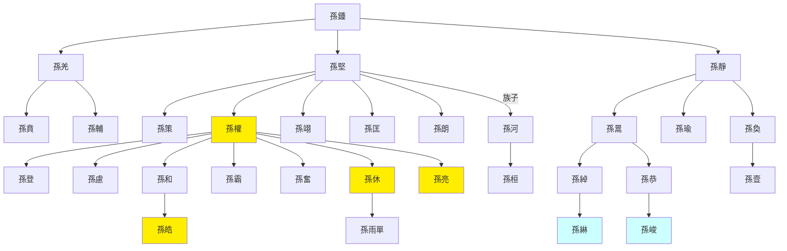

---
export_on_save:
    html: true
---

# 孫吳世系圖表

## 世系表

## 關系圖

```mermaid
graph TB

孫鍾-->孫羌
孫羌-->孫賁
孫羌-->孫輔

孫鍾-->孫堅
孫堅-->孫策
孫堅-->孫權
孫堅-->孫翊
孫堅-->孫匡
孫堅-->孫朗
孫堅--族子-->孫河

孫權-->孫登
孫權-->孫慮
孫權-->孫和
孫權-->孫霸
孫權-->孫奮
孫權-->孫休
孫權-->孫亮
孫和-->孫皓
孫休-->孫雨單
孫河-->孫桓

孫鍾-->孫靜
孫靜-->孫暠
孫暠-->孫綽
孫綽-->孫綝
孫暠-->孫恭
孫恭-->孫峻
孫靜-->孫瑜
孫靜-->孫奐
孫奐-->孫壹

classDef king fill:#ffee00
class 孫權,孫亮,孫休,孫皓 king

classDef control fill:#ccffff
class 孫峻,孫綝 control
```