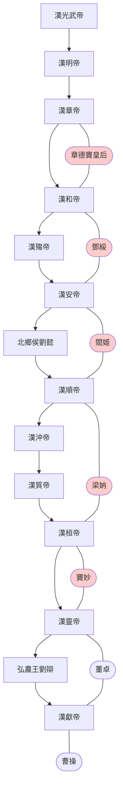
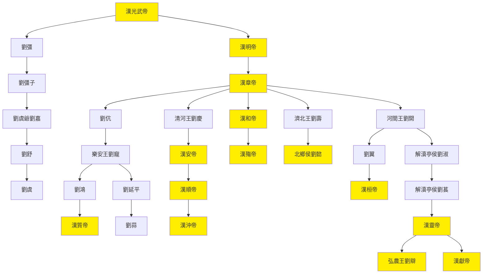

---
export_on_save:
    html: true
---

# 東漢世系圖表

<!--
## 世系表

@import "東漢世系表.csv"
-->

## 傳位圖

```mermaid
graph TB

漢光武帝-->漢明帝
漢明帝-->漢章帝
漢章帝-->漢和帝
漢章帝---章德竇皇后([章德竇皇后])
章德竇皇后([章德竇皇后])---漢和帝
漢和帝-->漢殤帝
漢殤帝-->漢安帝
漢和帝---鄧綏([鄧綏])
鄧綏([鄧綏])---漢安帝
漢安帝-->北鄉侯劉懿
北鄉侯劉懿-->漢順帝
漢安帝---閻姬([閻姬])
閻姬([閻姬])---漢順帝
漢順帝-->漢沖帝
漢沖帝-->漢質帝
漢質帝-->漢桓帝
漢順帝---梁妠([梁妠])
梁妠([梁妠])---漢桓帝
漢桓帝-->漢靈帝
漢桓帝---竇妙([竇妙])
竇妙([竇妙])---漢靈帝
漢靈帝-->弘農王劉辯
弘農王劉辯-->漢獻帝
漢靈帝---董卓([董卓])
董卓([董卓])---漢獻帝
漢獻帝---曹操([曹操])

classDef female fill:#ffcccc
class 章德竇皇后,鄧綏,閻姬,梁妠,竇妙 female
```

## 關系圖

```mermaid
graph TB

漢光武帝-->劉彊
劉彊-->劉彊子
劉彊子-->劉虞爺劉嘉
劉虞爺劉嘉-->劉舒
劉舒-->劉虞

漢光武帝-->漢明帝
漢明帝-->漢章帝

漢章帝-->劉伉
劉伉-->樂安王劉寵
樂安王劉寵-->劉鴻
劉鴻-->漢質帝
樂安王劉寵-->劉延平
劉延平-->劉蒜

漢章帝-->清河王劉慶
清河王劉慶-->漢安帝
漢安帝-->漢順帝
漢順帝-->漢沖帝

漢章帝-->漢和帝
漢和帝-->漢殤帝

漢章帝-->濟北王劉壽
濟北王劉壽-->北鄉侯劉懿

漢章帝-->河間王劉開
河間王劉開-->劉翼
劉翼-->漢桓帝
河間王劉開-->解瀆亭侯劉淑
解瀆亭侯劉淑-->解瀆亭侯劉萇
解瀆亭侯劉萇-->漢靈帝
漢靈帝-->弘農王劉辯
漢靈帝-->漢獻帝

classDef king fill:#ffee00
class 漢光武帝,漢明帝,漢章帝,漢和帝,漢殤帝,漢安帝,漢順帝,漢沖帝,漢質帝,漢桓帝,漢靈帝,漢獻帝,北鄉侯劉懿,弘農王劉辯 king
```
