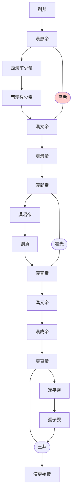
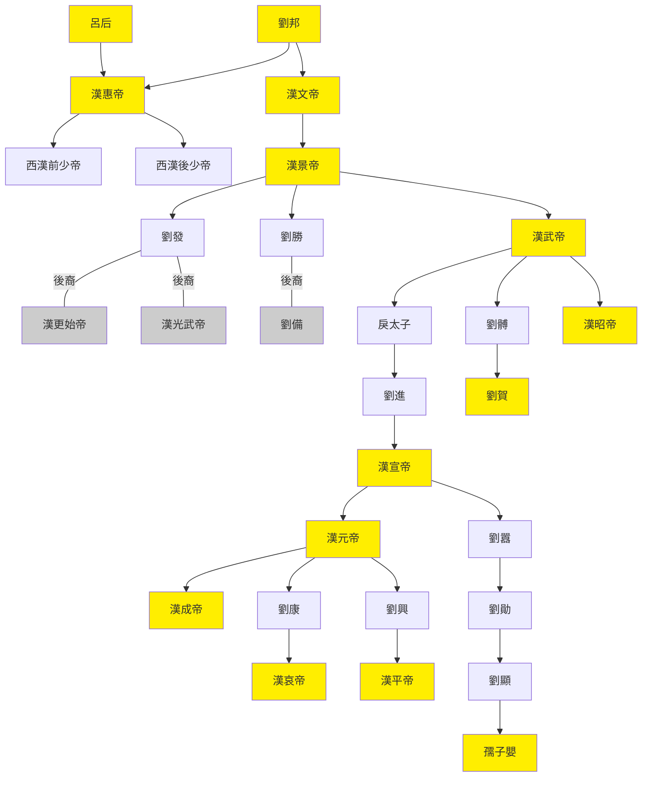

---
export_on_save:
    html: true
---

# 西漢世系圖表

## 世系表

@import "西漢世系表.csv"

## 傳位圖

```mermaid
graph TB

劉邦-->漢惠帝
漢惠帝-->西漢前少帝
漢惠帝---呂后([呂后])
西漢前少帝-->西漢後少帝
西漢後少帝-->漢文帝
呂后([呂后])---漢文帝
漢文帝-->漢景帝
漢景帝-->漢武帝
漢武帝---霍光([霍光])
漢武帝-->漢昭帝
漢昭帝-->劉賀
劉賀-->漢宣帝
霍光([霍光])---漢宣帝
漢宣帝-->漢元帝
漢元帝-->漢成帝
漢成帝-->漢哀帝
漢哀帝---王莽([王莽])
漢哀帝-->漢平帝
漢平帝-->孺子嬰
孺子嬰-->王莽([王莽])
王莽([王莽])-->漢更始帝

classDef female fill:#ffcccc
class 呂后 female
```

## 關系圖

```mermaid
graph TB

劉邦-->漢惠帝
呂后-->漢惠帝
漢惠帝-->西漢前少帝
漢惠帝-->西漢後少帝
劉邦-->漢文帝
漢文帝-->漢景帝
漢景帝-->劉發
劉發--後裔---漢更始帝
劉發--後裔---漢光武帝
漢景帝-->劉勝
劉勝--後裔---劉備
漢景帝-->漢武帝
漢武帝-->戾太子
戾太子-->劉進
漢武帝-->劉髆
劉髆-->劉賀
漢武帝-->漢昭帝
劉進-->漢宣帝
漢宣帝-->漢元帝
漢元帝-->漢成帝
漢元帝-->劉康
劉康-->漢哀帝
漢元帝-->劉興
劉興-->漢平帝
漢宣帝-->劉囂
劉囂-->劉勛
劉勛-->劉顯
劉顯-->孺子嬰

classDef king fill:#ffee00
class 劉邦,漢惠帝,呂后,漢前少帝,漢後少帝,漢文帝,漢景帝,漢武帝,漢昭帝,劉賀,漢宣帝,漢元帝,漢成帝,漢哀帝,漢平帝,孺子嬰 king

classDef far fill:#cccccc
class 漢更始帝,漢光武帝,劉備 far
```
