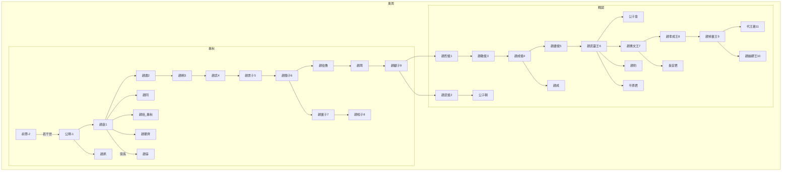

# 趙國世系圖

## 傳位圖

```mermaid
graph TB

subgraph 東周
    subgraph 春秋
        叔帶--若干世-->公明
        公明-->趙衰
        趙衰-->趙盾
        趙盾-->趙朔
        趙朔-->趙武
        趙武-->趙景子
        趙景子-->趙簡子
        趙簡子-->趙襄子
        趙襄子-->趙桓子
        趙桓子-->趙獻子
    end
    subgraph 戰國
        趙獻子-->趙烈侯
        趙烈侯-->趙武侯
        趙武侯-->趙敬侯
        趙敬侯-->趙成侯
        趙成侯-->趙肅侯
        趙肅侯-->趙武靈王
        趙武靈王-->趙惠文王
        趙惠文王-->趙孝成王
        趙孝成王-->趙悼襄王
        趙悼襄王-->趙幽繆王
        趙幽繆王-->代王嘉
    end
end

```

## 關系圖

```mermaid
graph TB

subgraph 東周
    subgraph 春秋
        叔帶-2--若干世-->公明-1
        公明-1-->趙衰1
        公明-1-->趙夙
        趙衰1-->趙盾2
        趙衰1-->趙同
        趙衰1-->趙括_春秋
        趙衰1-->趙嬰齊
        趙衰1--旁系-->趙穿
        趙盾2-->趙朔3
        趙朔3-->趙武4
        趙武4-->趙景子5
        趙景子5-->趙簡子6
        趙簡子6-->趙伯魯
        趙伯魯-->趙周
        趙簡子6-->趙襄子7
        趙襄子7-->趙桓子8
        趙周-->趙獻子9
    end
    subgraph 戰國
        趙獻子9-->趙烈侯1
        趙烈侯1-->趙敬侯3
        趙獻子9-->趙武侯2
        趙武侯2-->公子朝
        趙敬侯3-->趙成侯4
        趙成侯4-->趙肅侯5
        趙成侯4-->趙成
        趙肅侯5-->趙武靈王6
        趙武靈王6-->公子章
        趙武靈王6-->趙惠文王7
        趙武靈王6-->趙豹
        趙武靈王6-->平原君
        趙惠文王7-->趙孝成王8
        趙惠文王7-->長安君
        趙孝成王8-->趙悼襄王9
        趙悼襄王9-->代王嘉11
        趙悼襄王9-->趙幽繆王10
    end
end

```
