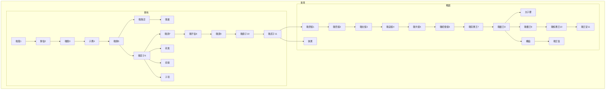

---
export_on_save:
    html: true
---

# 韓國世系圖表

## 世系表

@import "韓國世系表.csv"

## 傳位圖

```mermaid
graph TB

subgraph 東周
    subgraph 春秋
        韓萬-->賕伯
        賕伯-->韓簡
        韓簡-->子輿
        子輿-->韓厥
        韓厥-->韓宣子
        韓宣子-->韓須
        韓須-->韓不信
        韓不信-->韓庚
        韓庚-->韓康子
        韓康子-->韓武子
        韓武子-->韓景侯
    end
    subgraph 戰國
        韓景侯-->韓烈侯
        韓烈侯-->韓文侯
        韓文侯-->韓哀侯
        韓哀侯-->韓共侯
        韓共侯-->韓昭僖侯
        韓昭僖侯-->韓宣惠王
        韓宣惠王-->韓襄王
        韓襄王-->韓釐王
        韓釐王-->韓桓惠王
        韓桓惠王-->韓王安
    end
end

```

## 關系圖

```mermaid
graph TB

subgraph 東周
    subgraph 春秋
        韓萬1-->賕伯2
        賕伯2-->韓簡3
        韓簡3-->子輿4
        子輿4-->韓厥5
        韓厥5-->韓宣子6
        韓厥5-->韓無忌
        韓無忌-->韓襄
        韓宣子6-->韓須7
        韓宣子6-->叔禽
        韓宣子6-->叔椒
        韓宣子6-->子羽
        韓須7-->韓不信8
        韓不信8-->韓庚9
        韓庚9-->韓康子10
        韓康子10-->韓武子11
    end
    subgraph 戰國
        韓武子11-->韓景侯1
        韓武子11-->俠累
        韓景侯1-->韓烈侯2
        韓烈侯2-->韓文侯3
        韓文侯3-->韓哀侯4
        韓哀侯4-->韓共侯5
        韓共侯5-->韓昭僖侯6
        韓昭僖侯6-->韓宣惠王7
        韓宣惠王7-->韓襄王8
        韓襄王8-->太子嬰
        韓襄王8-->韓釐王9
        韓襄王8-->蟣蝨
        韓釐王9-->韓桓惠王10
        韓桓惠王10-->韓王安11
        蟣蝨-->韓王信
    end
end

```
