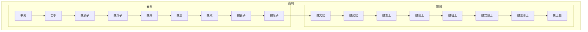
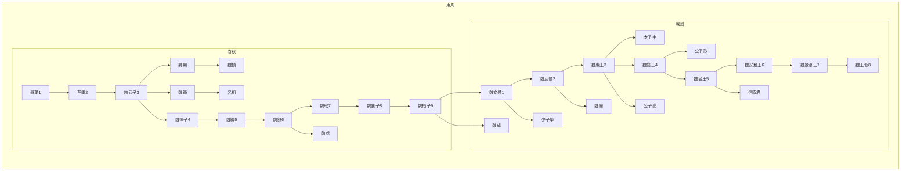

# 韓國世系圖

## 傳位圖

```mermaid
graph TB

subgraph 東周
    subgraph 春秋
        畢萬-->芒季
        芒季-->魏武子
        魏武子-->魏悼子
        魏悼子-->魏絳
        魏絳-->魏舒
        魏舒-->魏取
        魏取-->魏襄子
        魏襄子-->魏桓子
    end
    subgraph 戰國
        魏桓子-->魏文侯    
        魏文侯-->魏武侯
        魏武侯-->魏惠王
        魏惠王-->魏襄王
        魏襄王-->魏昭王
        魏昭王-->魏安釐王
        魏安釐王-->魏景湣王
        魏景湣王-->魏王假
    end
end

```

## 關系圖

```mermaid
graph TB

subgraph 東周
    subgraph 春秋
        畢萬1-->芒季2
        芒季2-->魏武子3
        魏武子3-->魏顆
        魏顆-->魏頡
        魏武子3-->魏錡
        魏錡-->呂相
        魏武子3-->魏悼子4
        魏悼子4-->魏絳5
        魏絳5-->魏舒6
        魏舒6-->魏取7
        魏舒6-->魏戊
        魏取7-->魏襄子8
        魏襄子8-->魏桓子9
    end
    subgraph 戰國
        魏桓子9-->魏文侯1
        魏桓子9-->魏成
        魏文侯1-->魏武侯2
        魏文侯1-->少子摯
        魏武侯2-->魏惠王3
        魏武侯2-->魏緩
        魏惠王3-->太子申
        魏惠王3-->魏襄王4
        魏惠王3-->公子高
        魏襄王4-->公子政
        魏襄王4-->魏昭王5
        魏昭王5-->魏安釐王6
        魏昭王5-->信陵君
        魏安釐王6-->魏景湣王7
        魏景湣王7-->魏王假8
    end
end

```
