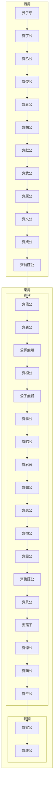
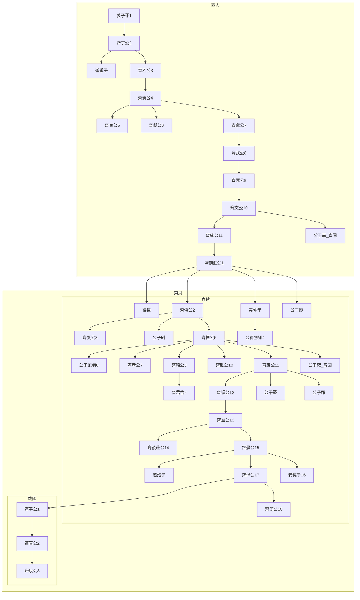
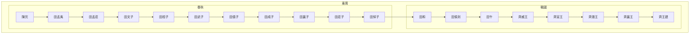
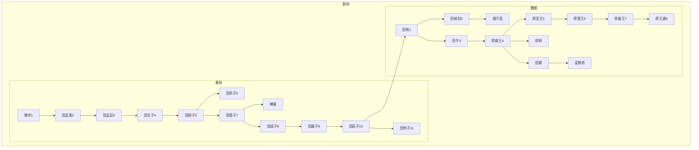

# 齊國世系圖

## 姜齊傳位圖

```mermaid
graph TB

subgraph 西周
    姜子牙-->齊丁公
    齊丁公-->齊乙公
    齊乙公-->齊癸公
    齊癸公-->齊哀公
    齊哀公-->齊胡公
    齊胡公-->齊獻公
    齊獻公-->齊武公
    齊武公-->齊厲公
    齊厲公-->齊文公
    齊文公-->齊成公
    齊成公-->齊前莊公
end

subgraph 東周
    subgraph 春秋
        齊前莊公-->齊僖公
        齊僖公-->齊襄公
        齊襄公-->公孫無知
        公孫無知-->齊桓公
        齊桓公-->公子無虧
        公子無虧-->齊孝公
        齊孝公-->齊昭公
        齊昭公-->齊君舍
        齊君舍-->齊懿公
        齊懿公-->齊惠公
        齊惠公-->齊頃公
        齊頃公-->齊靈公
        齊靈公-->齊後莊公
        齊後莊公-->齊景公
        齊景公-->安孺子
        安孺子-->齊悼公
        齊悼公-->齊簡公
        齊簡公-->齊平公
    end
    subgraph 戰國
        齊平公-->齊宣公
        齊宣公-->齊康公  
    end
end

```

## 姜齊關系圖

```mermaid
graph TB

subgraph 西周
    姜子牙1-->齊丁公2
    齊丁公2-->崔季子
    齊丁公2-->齊乙公3
    齊乙公3-->齊癸公4
    齊癸公4-->齊哀公5
    齊癸公4-->齊胡公6
    齊癸公4-->齊獻公7
    齊獻公7-->齊武公8
    齊武公8-->齊厲公9
    齊厲公9-->齊文公10
    齊文公10-->齊成公11
    齊文公10-->公子高_齊國
    齊成公11-->齊前莊公1
end

subgraph 東周
    subgraph 春秋
        齊前莊公1-->得臣
        齊前莊公1-->齊僖公2
        齊前莊公1-->夷仲年
        齊前莊公1-->公子廖
        齊僖公2-->齊襄公3
        齊僖公2-->公子糾
        齊僖公2-->齊桓公5
        夷仲年-->公孫無知4
        齊桓公5-->公子無虧6
        齊桓公5-->齊孝公7
        齊桓公5-->齊昭公8
        齊昭公8-->齊君舍9
        齊桓公5-->齊懿公10
        齊桓公5-->齊惠公11
        齊桓公5-->公子雍_齊國
        齊惠公11-->齊頃公12
        齊惠公11-->公子堅
        齊惠公11-->公子祁
        齊頃公12-->齊靈公13
        齊靈公13-->齊後莊公14
        齊靈公13-->齊景公15
        齊景公15-->燕姬子
        齊景公15-->齊悼公17
        齊景公15-->安孺子16        
        齊悼公17-->齊簡公18
    end
    subgraph 戰國
        齊悼公17-->齊平公1
        齊平公1-->齊宣公2
        齊宣公2-->齊康公3
    end
end

```

---

## 田齊傳位圖

```mermaid
graph TB

subgraph 東周
    subgraph 春秋
        陳完-->田孟夷
        田孟夷-->田孟莊
        田孟莊-->田文子
        田文子-->田桓子
        田桓子-->田武子
        田武子-->田僖子
        田僖子-->田成子
        田成子-->田襄子
        田襄子-->田莊子
        田莊子-->田悼子
    end
    subgraph 戰國
        田悼子-->田和
        田和-->田侯剡
        田侯剡-->田午
        田午-->齊威王
        齊威王-->齊宣王
        齊宣王-->齊湣王
        齊湣王-->齊襄王
        齊襄王-->齊王建
    end
end

```

## 田齊關系圖

```mermaid
graph TB

subgraph 東周
    subgraph 春秋
        陳完1-->田孟夷2
        田孟夷2-->田孟莊3
        田孟莊3-->田文子4
        田文子4-->田桓子5
        田桓子5-->田武子6
        田桓子5-->田僖子7
        田僖子7-->陳瓘
        田僖子7-->田成子8
        田成子8-->田襄子9
        田襄子9-->田莊子10
        田莊子10-->田悼子11
    end
    subgraph 戰國
        田莊子10-->田和1
        田和1-->田侯剡2
        田侯剡2-->孺子喜
        田和1-->田午3
        田午3-->齊威王4
        齊威王4-->齊宣王5
        齊威王4-->郊師
        齊威王4-->田嬰
        齊宣王5-->齊湣王6
        田嬰-->孟嘗君
        齊湣王6-->齊襄王7
        齊襄王7-->齊王建8
    end
end

```
