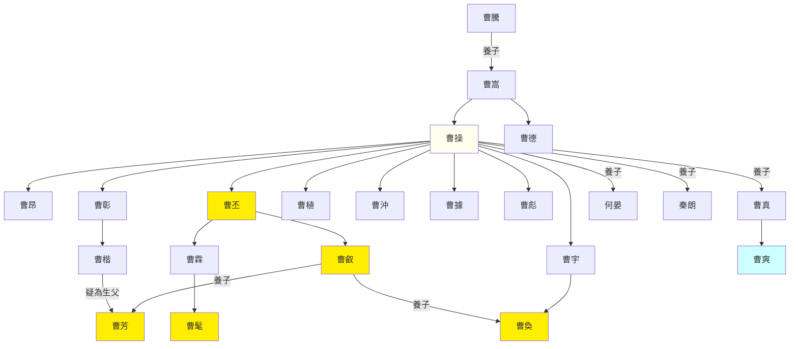
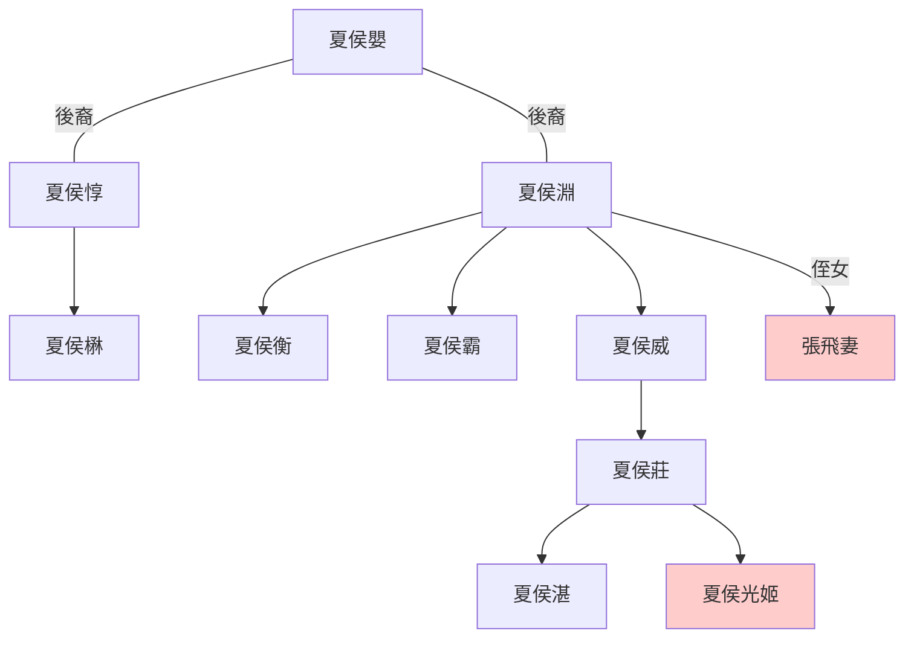

---
export_on_save:
    html: true
---

# 曹魏世系圖表

## 世系表

@import "曹魏世系表.csv"

## 曹氏關系圖

```mermaid
graph TB

曹騰--養子-->曹嵩
曹嵩-->曹操
曹嵩-->曹德

曹操-->曹昂
曹操-->曹丕
曹操-->曹彰
曹操-->曹植
曹操-->曹沖
曹操-->曹據
曹操-->曹宇
曹操-->曹彪
曹操--養子-->曹真
曹操--養子-->何晏
曹操--養子-->秦朗

曹丕-->曹叡
曹丕-->曹霖
曹彰-->曹楷
曹宇-->曹奐
曹真-->曹爽

曹叡--養子-->曹芳
曹叡--養子-->曹奐
曹楷--疑為生父-->曹芳
曹霖-->曹髦

classDef king fill:#ffee00
class 曹丕,曹叡,曹芳,曹髦,曹奐 king

classDef control fill:#ccffff
class 曹爽 control

classDef founder fill:#ffffee
class 曹操 founder
```

## 夏侯氏關系圖

```mermaid
graph TB

夏侯嬰--後裔---夏侯惇
夏侯嬰--後裔---夏侯淵

夏侯惇-->夏侯楙
夏侯淵-->夏侯衡
夏侯淵-->夏侯霸
夏侯淵-->夏侯威
夏侯淵--侄女-->張飛妻

夏侯威-->夏侯莊
夏侯莊-->夏侯湛
夏侯莊-->夏侯光姬

classDef female fill:#ffcccc
class 張飛妻,夏侯光姬 female
```