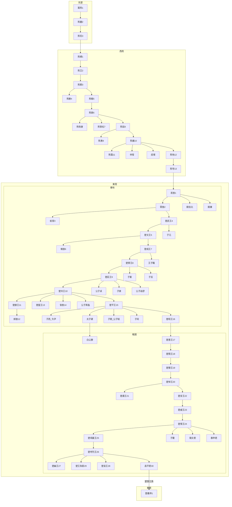

---
export_on_save:
    html: true
---

# 楚國世系圖表

## 世系表

@import "楚國世系表.csv"

## 傳位圖

```mermaid
graph TB

subgraph 先楚
    鬻熊-->熊麗
    熊麗-->熊狂
end

subgraph 西周
    熊狂-->熊繹
    熊繹-->熊艾
    熊艾-->熊䵣
    熊䵣-->熊勝
    熊勝-->熊楊
    熊楊-->熊渠
    熊渠-->熊摯紅
    熊摯紅-->熊延
    熊延-->熊勇
    熊勇-->熊嚴
    熊嚴-->熊霜
    熊霜-->熊徇
    熊徇-->熊咢
end

subgraph 東周
    subgraph 春秋
        熊咢-->若敖
        若敖-->霄敖
        霄敖-->蚡冒
        蚡冒-->楚武王
        楚武王-->楚文王
        楚文王-->堵敖
        堵敖-->楚成王
        楚成王-->楚穆王
        楚穆王-->楚莊王
        楚莊王-->楚共王
        楚共王-->楚康王
        楚康王-->郟敖
        郟敖-->楚靈王
        楚靈王-->訾敖
        訾敖-->楚平王
        楚平王-->楚昭王
    end
    subgraph 戰國
        楚昭王-->楚惠王
        楚惠王-->楚簡王
        楚簡王-->楚聲王
        楚聲王-->楚悼王
        楚悼王-->楚肅王
        楚肅王-->楚宣王
        楚宣王-->楚威王
        楚威王-->楚懷王
        楚懷王-->楚頃襄王
        楚頃襄王-->楚考烈王
        楚考烈王-->楚幽王
        楚幽王-->楚哀王
        楚哀王-->楚王負芻
        楚王負芻-->昌平君
    end
end

subgraph 秦朝
    昌平君--項梁擁立-->楚義帝
end

```

## 關系圖

```mermaid
graph TB

subgraph 先楚
    鬻熊1-->熊麗2
    熊麗2-->熊狂3
end

subgraph 西周
    熊狂3-->熊繹1
    熊繹1-->熊艾2
    熊艾2-->熊䵣3
    熊䵣3-->熊勝4
    熊䵣3-->熊楊5
    熊楊5-->熊渠6
    熊渠6-->熊毋康
    熊渠6-->熊摯紅7
    熊渠6-->熊延8
    熊延8-->熊勇9
    熊延8-->熊嚴10
    熊嚴10-->熊霜11
    熊嚴10-->仲雪
    熊嚴10-->叔堪
    熊嚴10-->熊徇12
    熊徇12-->熊咢13
end

subgraph 東周
    subgraph 春秋
        熊咢13-->若敖1
        若敖1-->霄敖2
        若敖1-->鬬伯比
        若敖1-->鬬廉
        霄敖2-->蚡冒3
        霄敖2-->楚武王4
        楚武王4-->楚文王5
        楚武王4-->子元
        楚文王5-->堵敖6
        楚文王5-->楚成王7
        楚成王7-->楚穆王8
        楚成王7-->王子職
        楚穆王8-->楚莊王9
        楚穆王8-->子重
        楚穆王8-->子反
        楚莊王9-->楚共王10
        楚莊王9-->公子貞
        楚莊王9-->子庚
        楚莊王9-->公子追舒
        楚共王10-->楚康王11
        楚共王10-->楚靈王13
        楚共王10-->訾敖14
        楚共王10-->公子黑肱
        楚共王10-->楚平王15
        楚康王11-->郟敖12
        楚平王15-->子西_令尹
        楚平王15-->太子建
        楚平王15-->子期_公子結
        楚平王15-->子闾
        楚平王15-->楚昭王16                  
    end
    subgraph 戰國
        太子建-->白公勝
        楚昭王16-->楚惠王17
        楚惠王17-->楚簡王18
        楚簡王18-->楚聲王19
        楚聲王19-->楚悼王20
        楚悼王20-->楚肅王21
        楚悼王20-->楚宣王22
        楚宣王22-->楚威王23
        楚威王23-->楚懷王24
        楚懷王24-->楚頃襄王25
        楚懷王24-->子蘭
        楚懷王24-->陽文君
        楚懷王24-->春申君
        楚頃襄王25-->楚考烈王26
        楚考烈王26-->楚幽王27
        楚考烈王26-->楚王負芻29
        楚考烈王26-->楚哀王28
        楚考烈王26-->昌平君30
    end
end

subgraph 秦朝
    昌平君30--楚懷王孫-->楚義帝1
end

```
