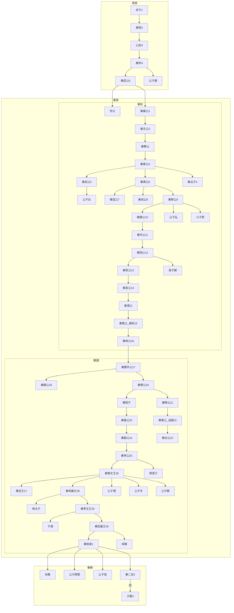

---
export_on_save:
    html: true
---

# 秦國世系圖表

## 世系表

@import "秦國世系表.csv"

## 傳位圖

```mermaid
graph TB

subgraph 西周
    非子-->秦侯
    秦侯-->公伯
    公伯-->秦仲
    秦仲-->秦莊公
end

subgraph 東周
    subgraph 春秋
        秦莊公-->秦襄公
        秦襄公-->秦文公
        秦文公-->秦憲公
        秦憲公-->秦出子
        秦出子-->秦武公
        秦武公-->秦德公
        秦德公-->秦宣公
        秦宣公-->秦成公
        秦成公-->秦穆公
        秦穆公-->秦康公
        秦康公-->秦共公
        秦共公-->秦桓公
        秦桓公-->秦景公
        秦景公-->秦哀公
        秦哀公-->秦惠公_春秋
        秦惠公_春秋-->秦悼公
    end
    subgraph 戰國
        秦悼公-->秦厲共公
        秦厲共公-->秦躁公
        秦躁公-->秦懷公
        秦懷公-->秦靈公
        秦靈公-->秦簡公
        秦簡公-->秦惠公_战国
        秦惠公_战国-->秦出公
        秦出公-->秦獻公
        秦獻公-->秦孝公
        秦孝公-->秦惠文王
        秦惠文王-->秦武王
        秦武王-->秦昭襄王
        秦昭襄王-->秦孝文王
        秦孝文王-->秦莊襄王    
    end
end

subgraph 秦朝
    秦莊襄王-->秦始皇
    秦始皇-->秦二世
    秦二世-->子嬰
end

```

## 關系圖

```mermaid
graph TB

subgraph 西周
    非子1-->秦侯2
    秦侯2-->公伯3
    公伯3-->秦仲4
    秦仲4-->秦莊公5
    秦仲4-->公子康
end

subgraph 東周
    subgraph 春秋
        秦莊公5-->世父
        秦莊公5-->秦襄公1
        秦襄公1-->秦文公2
        秦文公2-->秦靜公
        秦靜公-->秦憲公3
        秦憲公3-->秦武公5
        秦憲公3-->秦德公6
        秦憲公3-->秦出子4
        秦武公5-->公子白
        秦德公6-->秦宣公7
        秦德公6-->秦成公8
        秦德公6-->秦穆公9
        秦穆公9-->秦康公10
        秦穆公9-->公子弘
        秦穆公9-->小子憖
        秦康公10-->秦共公11
        秦共公11-->秦桓公12
        秦桓公12-->秦景公13
        秦桓公12-->後子鍼
        秦景公13-->秦哀公14
        秦哀公14-->秦夷公
        秦夷公-->秦惠公_春秋15
        秦惠公_春秋15-->秦悼公16
    end
    subgraph 戰國
        秦悼公16-->秦厲共公17
        秦厲共公17-->秦躁公18
        秦厲共公17-->秦懷公19
        秦懷公19-->秦昭子
        秦昭子-->秦靈公20
        秦靈公20-->秦獻公24
        秦懷公19-->秦簡公21
        秦簡公21-->秦惠公_战国22
        秦惠公_战国22-->秦出公23
        秦獻公24-->秦孝公25
        秦孝公25-->秦惠文王26
        秦孝公25-->樗里子
        秦惠文王26-->秦武王27
        秦惠文王26-->秦昭襄王28
        秦惠文王26-->公子悝
        秦惠文王26-->公子市
        秦惠文王26-->公子顯
        秦昭襄王28-->悼太子
        秦昭襄王28-->秦孝文王29
        秦孝文王29-->子傒
        秦孝文王29-->秦莊襄王30
        秦莊襄王30-->秦始皇1
        秦莊襄王30-->成蟜
    end
end

subgraph 秦朝
    秦始皇1-->扶蘇
    秦始皇1-->公子將閭
    秦始皇1-->公子高
    秦始皇1-->秦二世2
    秦二世2--侄-->子嬰3
end

```
