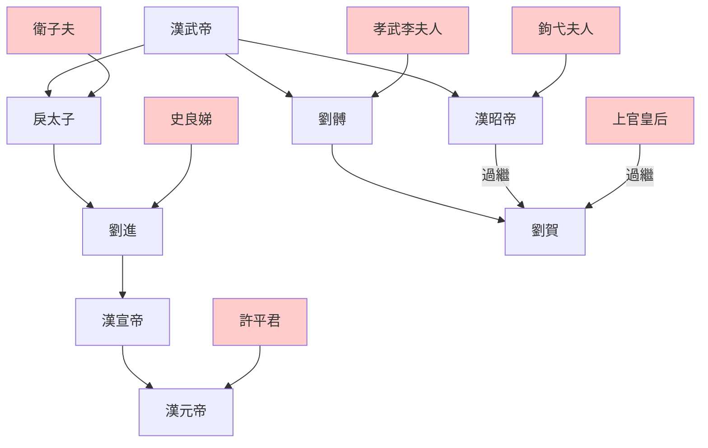

---
export_on_save:
    html: true
---

# 漢武帝子嗣

## 子嗣表

姓名|常用名|母|详情
--|--|--|--
刘据|戾太子|卫子夫|太子，死于巫蛊之祸，孙为汉宣帝
刘闳|齐怀王|王夫人|次子，早夭
刘旦|燕剌王|李姬|三子，汉武帝病重要求宿卫被削，後謀反
刘胥|广陵王|李姬|四子，力能扛鼎无法度
刘髆|昌邑王|孝武李夫人|五子，子为汉废帝刘贺
刘弗陵|汉昭帝|钩弋夫人|幼子，汉昭帝，杀母立子
卫长公主||卫子夫|长女，嫁曹襄、栾大
诸邑公主||卫子夫?|死于巫蛊之祸
阳石公主||卫子夫?|与公孙敬声通奸，死于巫蛊之祸
鄂邑长公主|||抚养汉昭帝，谋诛霍光败後自杀
夷安公主|||嫁隆虑公主子昭平君
石邑公主?||卫子夫?|

## 漢武帝子嗣皇帝示意圖

