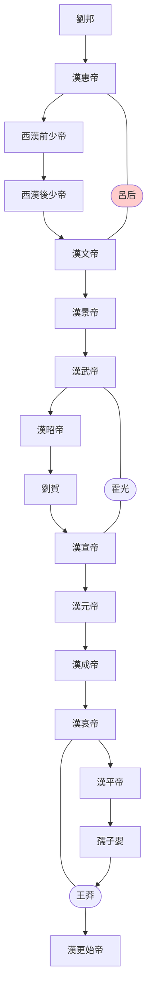
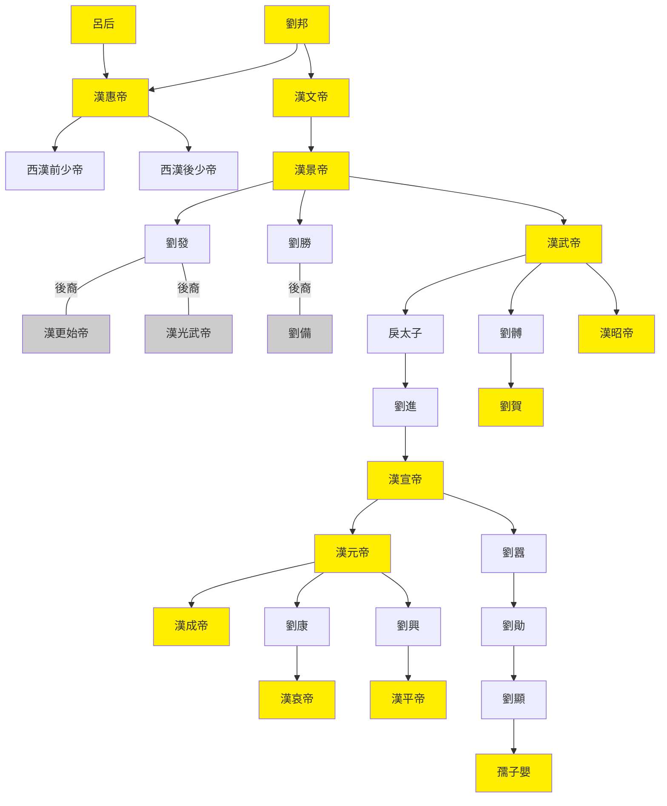

---
export_on_save:
    html: true
---

# 西漢世系圖表

## 世系表

@import "西漢世系表.csv"

## 傳位圖

## 關系圖

## 漢惠帝掛名子嗣表

姓名|别名|卒年|封号|谥号|备注
--|--|--|--|--|--
刘？||-184|前少帝||傀儡一号，一说名刘恭
刘强|刘彊|-183|淮阳王|怀|
刘不疑||-186|恒山王|哀|
刘弘|刘山、刘义|-180|恒山王、後少帝||傀儡二号
刘朝||-180|轵侯、恒山王||
刘武||-180|壶关侯、淮阳王||
刘太||-180|昌平侯、吕王、济川王、梁王||最幼子