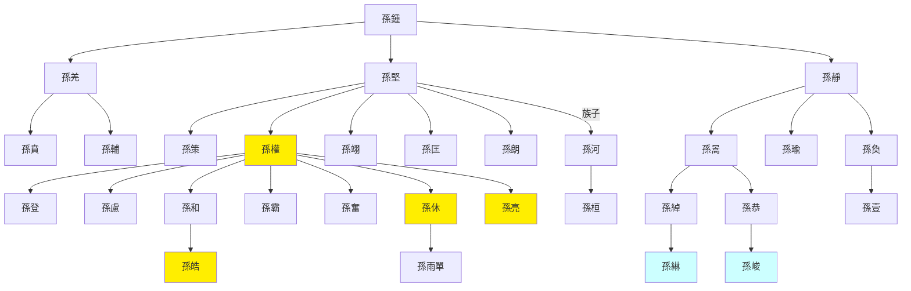
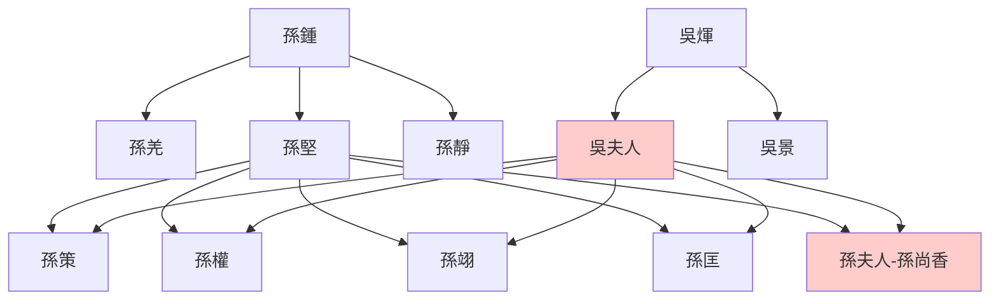
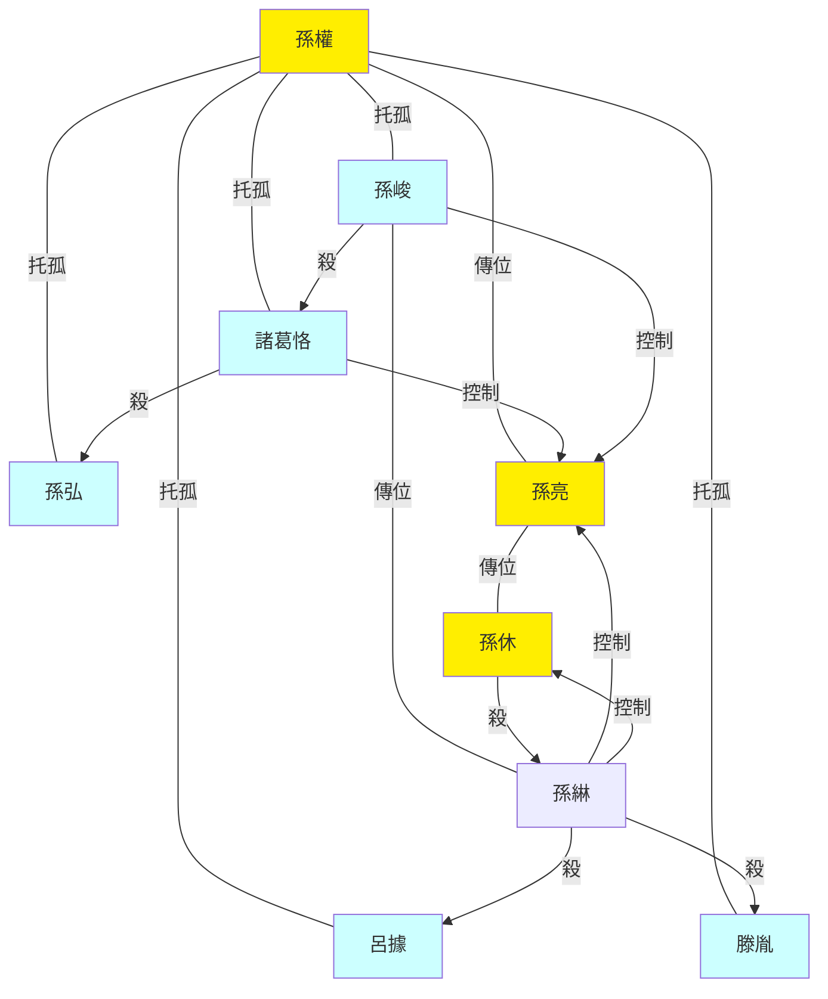

---
export_on_save:
    html: true
---

# 孫吳世系圖表

## 世系表

@import "孫吳世系表.csv"

## 關系圖

```mermaid
graph TB

孫鍾-->孫羌
孫羌-->孫賁
孫羌-->孫輔

孫鍾-->孫堅
孫堅-->孫策
孫堅-->孫權
孫堅-->孫翊
孫堅-->孫匡
孫堅-->孫朗
孫堅--族子-->孫河

孫權-->孫登
孫權-->孫慮
孫權-->孫和
孫權-->孫霸
孫權-->孫奮
孫權-->孫休
孫權-->孫亮
孫和-->孫皓
孫休-->孫雨單
孫河-->孫桓

孫鍾-->孫靜
孫靜-->孫暠
孫暠-->孫綽
孫綽-->孫綝
孫暠-->孫恭
孫恭-->孫峻
孫靜-->孫瑜
孫靜-->孫奐
孫奐-->孫壹

classDef king fill:#ffee00
class 孫權,孫亮,孫休,孫皓 king

classDef control fill:#ccffff
class 孫峻,孫綝 control
```

## 吳夫人、孫尚香關系圖

```mermaid
graph TB
孫鍾-->孫羌

孫鍾-->孫堅
孫堅-->孫策
孫堅-->孫權
孫堅-->孫翊
孫堅-->孫匡
孫堅-->孫夫人-孫尚香

孫鍾-->孫靜

吳煇-->吳夫人
吳煇-->吳景
吳夫人-->孫策
吳夫人-->孫權
吳夫人-->孫翊
吳夫人-->孫匡
吳夫人-->孫夫人-孫尚香

classDef female fill:#ffcccc
class 吳夫人,孫夫人-孫尚香 female
```

## 孫權托孤亂政圖

```mermaid
graph TB

孫權--托孤---諸葛恪
孫權--托孤---孫峻
孫權--托孤---孫弘
孫權--托孤---呂據
孫權--托孤---滕胤
孫權--傳位---孫亮
孫亮--傳位---孫休

諸葛恪--殺-->孫弘
孫峻--殺-->諸葛恪
孫峻--傳位---孫綝
孫綝--殺-->呂據
孫綝--殺-->滕胤

諸葛恪--控制-->孫亮
孫峻--控制-->孫亮
孫綝--控制-->孫亮
孫綝--控制-->孫休

孫休--殺-->孫綝

classDef king fill:#ffee00
class 孫權,孫亮,孫休 king

classDef far fill:#ccffff
class 諸葛恪,孫峻,孫弘,呂據,滕胤 far
```