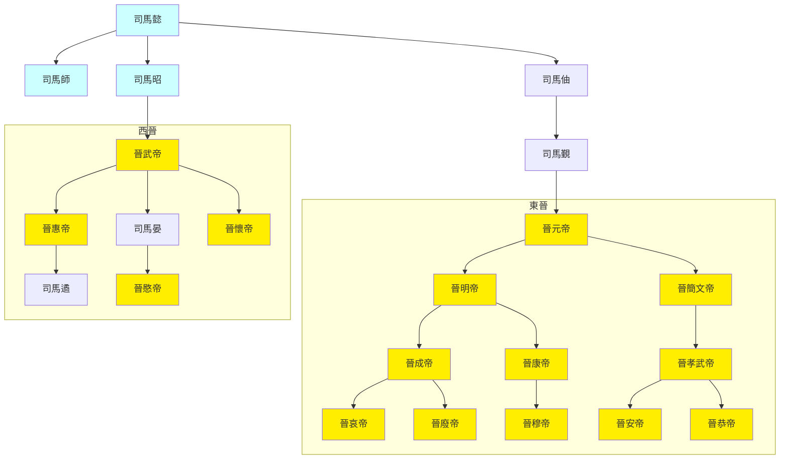

---
export_on_save:
    html: true
---

# 晉朝世系圖表

## 世系表

@import "晉朝世系表.csv"

## 關系圖

- 二傻亡晉：晉惠帝引發八王之亂亡西晉，晉安帝引發桓玄代晉亡東晉

```mermaid
graph TB

司馬懿-->司馬師

司馬懿-->司馬伷
司馬伷-->司馬覲
司馬覲-->晉元帝
subgraph 東晉
    晉元帝-->晉明帝
    晉明帝-->晉成帝
    晉明帝-->晉康帝
    晉成帝-->晉哀帝
    晉成帝-->晉廢帝
    晉康帝-->晉穆帝
    晉元帝-->晉簡文帝
    晉簡文帝-->晉孝武帝
    晉孝武帝-->晉安帝
    晉孝武帝-->晉恭帝
end

司馬懿-->司馬昭
司馬昭-->晉武帝
subgraph 西晉
    晉武帝-->晉惠帝
    晉惠帝-->司馬遹

    晉武帝-->司馬晏
    司馬晏-->晉愍帝

    晉武帝-->晉懷帝
end

classDef king fill:#ffee00
class 晉武帝,晉惠帝,晉懷帝,晉愍帝,晉元帝,晉明帝,晉成帝,晉康帝,晉穆帝,晉哀帝,晉廢帝,晉簡文帝,晉孝武帝,晉安帝,晉恭帝 king

classDef control fill:#ccffff
class 司馬懿,司馬師,司馬昭 control
```