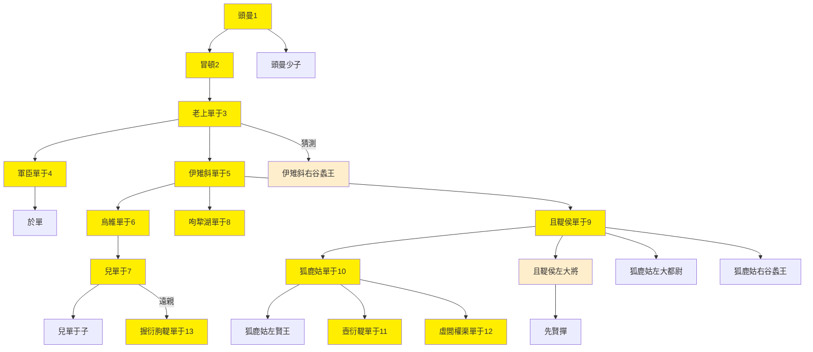
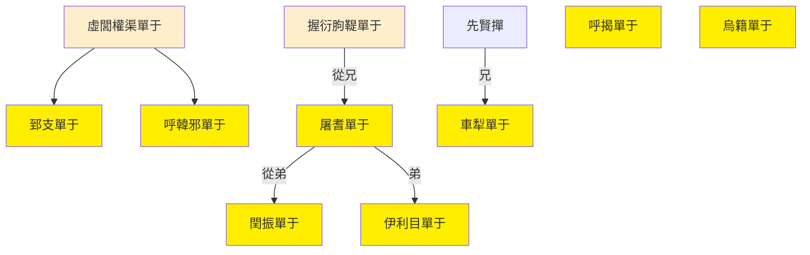
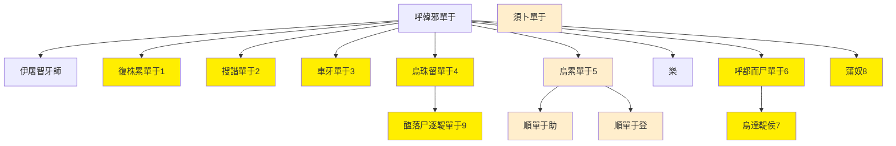
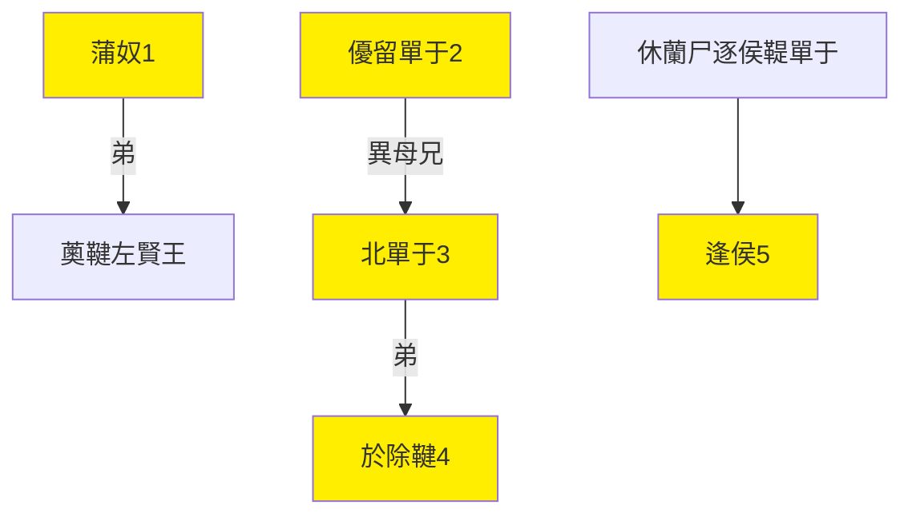
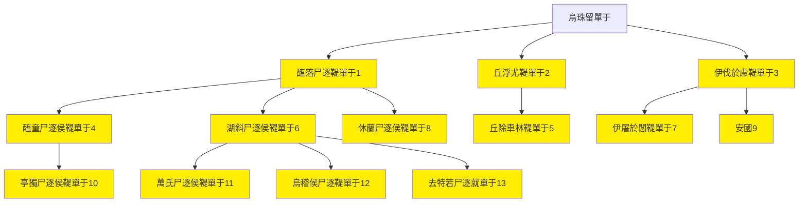

# 匈奴世系圖

## 漢初統一時期

```mermaid
graph TB

頭曼1-->冒頓2
頭曼1-->頭曼少子
冒頓2-->老上單于3
老上單于3-->軍臣單于4
軍臣單于4-->於單
老上單于3-->伊雉斜單于5
老上單于3--猜測-->伊雉斜右谷蠡王
伊雉斜單于5-->烏維單于6
烏維單于6-->兒單于7
兒單于7-->兒單于子
伊雉斜單于5-->呴犂湖單于8
伊雉斜單于5-->且鞮侯單于9
且鞮侯單于9-->狐鹿姑單于10
且鞮侯單于9-->且鞮侯左大將
且鞮侯單于9-->狐鹿姑左大都尉
且鞮侯單于9-->狐鹿姑右谷蠡王
且鞮侯左大將-->先賢撣
狐鹿姑單于10-->狐鹿姑左賢王
狐鹿姑單于10-->壺衍鞮單于11
狐鹿姑單于10-->虛閭權渠單于12
兒單于7--遠親-->握衍朐鞮單于13

classDef chanyu fill:#ffee00
class 頭曼1,冒頓2,老上單于3,軍臣單于4,伊雉斜單于5,烏維單于6,兒單于7,呴犂湖單于8,且鞮侯單于9,狐鹿姑單于10,壺衍鞮單于11,虛閭權渠單于12,握衍朐鞮單于13 chanyu

classDef nearchanyu fill:#ffeecc
class 伊雉斜右谷蠡王,且鞮侯左大將 nearchanyu

```

## 五單于爭立

```mermaid
graph TB

虛閭權渠單于-->郅支單于
虛閭權渠單于-->呼韓邪單于

握衍朐鞮單于--從兄-->屠耆單于
屠耆單于--從弟-->閏振單于
屠耆單于--弟-->伊利目單于

先賢撣--兄-->車犁單于

呼揭單于
烏籍單于

classDef wuchanyu fill:#ffee00
class 呼韓邪單于,屠耆單于,呼揭單于,車犁單于,烏籍單于,閏振單于,郅支單于,伊利目單于 wuchanyu

classDef otherchanyu fill:#ffeecc
class 虛閭權渠單于,握衍朐鞮單于 otherchanyu

```

## 王莽時期及再統一時期

```mermaid
graph TB

呼韓邪單于-->伊屠智牙師
呼韓邪單于-->復株累單于1
呼韓邪單于-->搜諧單于2
呼韓邪單于-->車牙單于3
呼韓邪單于-->烏珠留單于4
呼韓邪單于-->烏累單于5
呼韓邪單于-->樂
呼韓邪單于-->呼都而尸單于6
呼韓邪單于-->蒲奴8
呼都而尸單于6-->烏達鞮侯7
烏珠留單于4-->醢落尸逐鞮單于9

烏累單于5-->順單于助
烏累單于5-->順單于登

須卜單于

classDef chanyu fill:#ffee00
class 復株累單于1,搜諧單于2,車牙單于3,烏珠留單于4,烏累單于5,呼都而尸單于6,烏達鞮侯7,蒲奴8,醢落尸逐鞮單于9 chanyu

classDef otherchanyu fill:#ffeecc
class 烏累單于5,順單于助,順單于登,須卜單于 otherchanyu

```

## 北匈奴

```mermaid
graph TB

蒲奴1--弟-->薁鞬左賢王

優留單于2--異母兄-->北單于3
北單于3--弟-->於除鞬4
休蘭尸逐侯鞮單于-->逢侯5

classDef chanyu fill:#ffee00
class 蒲奴1,優留單于2,北單于3,於除鞬4,逢侯5 chanyu
```

## 南匈奴

```mermaid
graph TB

烏珠留單于-->醢落尸逐鞮單于1
烏珠留單于-->丘浮尤鞮單于2
烏珠留單于-->伊伐於慮鞮單于3
醢落尸逐鞮單于1-->醢童尸逐侯鞮單于4
丘浮尤鞮單于2-->丘除車林鞮單于5
醢落尸逐鞮單于1-->湖斜尸逐侯鞮單于6
伊伐於慮鞮單于3-->伊屠於閭鞮單于7
醢落尸逐鞮單于1-->休蘭尸逐侯鞮單于8
伊伐於慮鞮單于3-->安國9
醢童尸逐侯鞮單于4-->亭獨尸逐侯鞮單于10
湖斜尸逐侯鞮單于6-->萬氏尸逐侯鞮單于11
湖斜尸逐侯鞮單于6-->烏稽侯尸逐鞮單于12
湖斜尸逐侯鞮單于6-->去特若尸逐就單于13

classDef chanyu fill:#ffee00
class 醢落尸逐鞮單于1,丘浮尤鞮單于2,伊伐於慮鞮單于3,醢童尸逐侯鞮單于4,丘除車林鞮單于5,湖斜尸逐侯鞮單于6,伊屠於閭鞮單于7,休蘭尸逐侯鞮單于8,安國9,亭獨尸逐侯鞮單于10,萬氏尸逐侯鞮單于11,烏稽侯尸逐鞮單于12,去特若尸逐就單于13 chanyu
```
