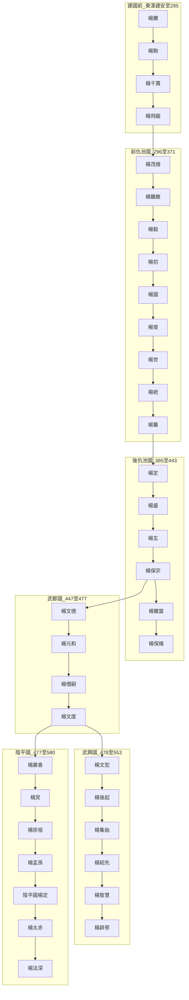

---
export_on_save:
    html: true
---

# 仇池國世系圖表

- 仇池為氐族
- 前仇池國被前秦攻滅
- 楊定復仇池國，忠於東晉，晉滅後仍使用年號

```mermaid
graph TB

subgraph 建國前_東漢建安至295
    楊騰-->楊駒
    楊駒-->楊千萬
    楊千萬-->楊飛龍
end
subgraph 前仇池國_296至371
    楊飛龍-->楊茂搜
    楊茂搜-->楊難敵
    楊難敵-->楊毅
    楊毅-->楊初
    楊初-->楊國
    楊國-->楊俊
    楊俊-->楊世
    楊世-->楊統
    楊統-->楊纂
end
subgraph 後仇池國_385至443
    楊纂-->楊定
    楊定-->楊盛
    楊盛-->楊玄
    楊玄-->楊保宗
    楊保宗-->楊難當
    楊難當-->楊保熾
end
subgraph 武都國_447至477
    楊保宗-->楊文德
    楊文德-->楊元和
    楊元和-->楊僧嗣
    楊僧嗣-->楊文度
end
subgraph 武興國_478至553
    楊文度-->楊文宏
    楊文宏-->楊後起
    楊後起-->楊集始
    楊集始-->楊紹先
    楊紹先-->楊智慧
    楊智慧-->楊辟邪
end
subgraph 陰平國_477至580
    楊文度-->楊廣香
    楊廣香-->楊炅
    楊炅-->楊崇祖
    楊崇祖-->楊孟孫
    楊孟孫-->陰平國楊定
    陰平國楊定-->楊太赤
    楊太赤-->楊法深
end
```