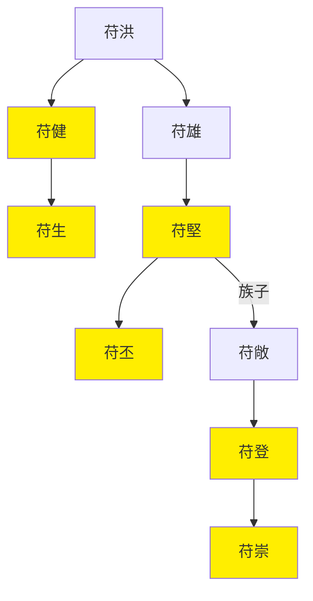

---
export_on_save:
    html: true
---

# 前秦世系圖表

## 世系表

@import "前秦世系表.csv"

## 世系圖

- 苻堅用王猛，滅前燕、仇池，得益州，滅前涼、拓跋代，使呂光征西域，淝水之戰一敗塗地

```mermaid
graph TB

苻洪-->苻健
苻洪-->苻雄

苻健-->苻生
苻雄-->苻堅

苻堅-->苻丕
苻堅--族子-->苻敞

苻敞-->苻登

苻登-->苻崇


classDef king fill:#ffee00
class 苻健,苻生,苻堅,苻丕,苻登,苻崇 king
```