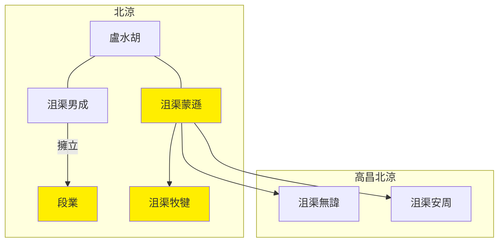

---
export_on_save:
    html: true
---

# 北涼世系圖表

## 世系表

@import "北涼世系表.csv"

## 世系圖

- 439年北魏滅北涼
- 442年沮渠無諱建立高昌北涼苟延

```mermaid
graph TB

subgraph 北涼
    盧水胡---沮渠男成
    沮渠男成--擁立-->段業
    盧水胡---沮渠蒙遜
    沮渠蒙遜-->沮渠牧犍    
end

subgraph 高昌北涼
    沮渠蒙遜-->沮渠無諱
    沮渠蒙遜-->沮渠安周
end

classDef king fill:#ffee00
class 段業,沮渠蒙遜,沮渠牧犍 king
```