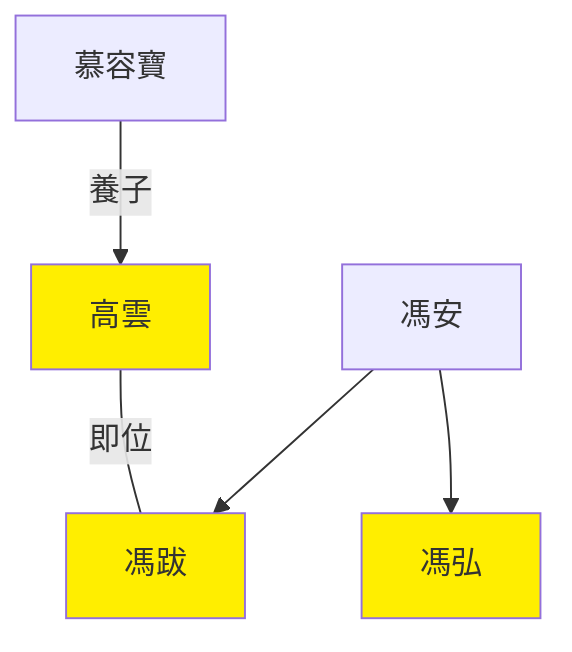

---
export_on_save:
    html: true
---

# 北燕世系圖表

## 世系表

@import "北燕世系表.csv"

## 世系圖

- 高雲被馮跋推為北燕君主，滅後燕
- 高雲被部下殺，馮跋被推為主
- 馮跋被馮弘嚇死，馮弘被北魏打殘，死於高句麗

```mermaid
graph TB

慕容寶--養子-->高雲

馮安-->馮跋
馮安-->馮弘
高雲--即位---馮跋

classDef king fill:#ffee00
class 高雲,馮跋,馮弘 king
```