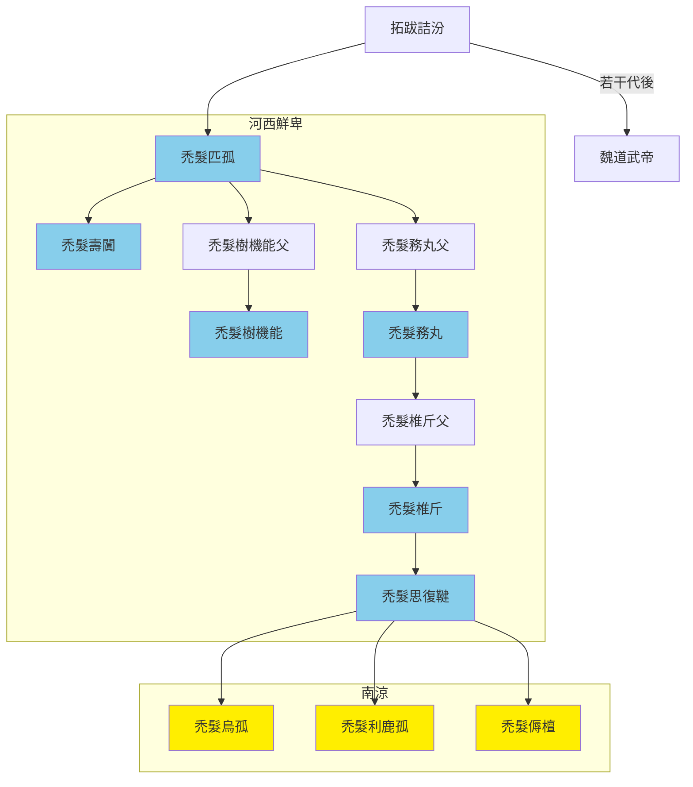

---
export_on_save:
    html: true
---

# 南涼世系圖表

## 世系表

@import "南涼世系表.csv"

## 世系圖

- 河西鮮卑後裔，至禿髮烏孤時，不服呂光自立

```mermaid
graph TB

拓跋詰汾-->禿髮匹孤
拓跋詰汾--若干代後-->魏道武帝

subgraph 河西鮮卑
    禿髮匹孤-->禿髮壽闐
    禿髮匹孤-->禿髮樹機能父
    禿髮匹孤-->禿髮務丸父

    禿髮樹機能父-->禿髮樹機能
    禿髮務丸父-->禿髮務丸

    禿髮務丸-->禿髮椎斤父
    禿髮椎斤父-->禿髮椎斤

    禿髮椎斤-->禿髮思復鞬
end

subgraph 南涼
    禿髮思復鞬-->禿髮烏孤
    禿髮思復鞬-->禿髮利鹿孤
    禿髮思復鞬-->禿髮傉檀
end

classDef hexi fill:#87CEEB
class 禿髮匹孤,禿髮壽闐,禿髮樹機能,禿髮務丸,禿髮椎斤,禿髮思復鞬 hexi

classDef king fill:#ffee00
class 禿髮烏孤,禿髮利鹿孤,禿髮傉檀 king
```