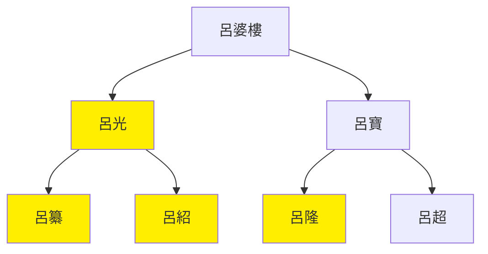

---
export_on_save:
    html: true
---

# 後涼世系圖表

## 世系表

@import "後涼世系表.csv"

## 世系圖

- 苻堅髮小呂婆樓之子呂光，淝水之戰前征西域，回來苻堅已死，類似趙佗，但鳩摩羅什勸他別扎根西域
- 386年呂光入涼州自稱涼州牧、酒泉公，389年稱三河王，396年稱大涼天王
- 呂光死後，呂紹即位速被呂纂殺
- 呂纂被呂超殺，推立呂隆控制不住南北西三涼，降後秦
    - 姚興死時呂隆、呂超參與造反失敗，被姚泓誅

