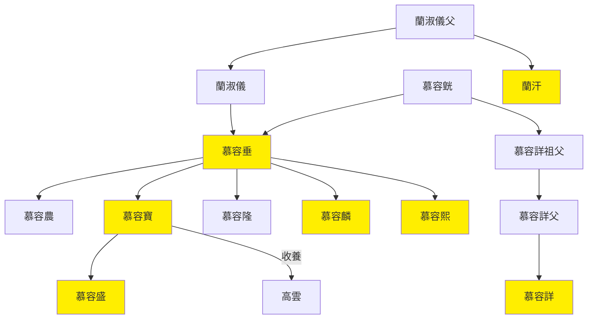

---
export_on_save:
    html: true
---

# 後燕世系圖表

## 世系表

@import "後燕世系表.csv"

## 世系圖

- 慕容垂逃離苻堅開基，傳給慕容寶半殘
- 經參合陂之戰、柏肆之戰，慕容寶棄都中山
    - 慕容詳來不及逃跑，在中山稱帝，迅速被慕容麟做掉，又被北魏滅
- 高句麗人高雲助慕容寶破慕容會叛亂，被收為養子
- 慕容寶被舅姥爺蘭汗幹掉，他兒子慕容盛又迅速幹掉老舅姥爺兼老丈人蘭汗

