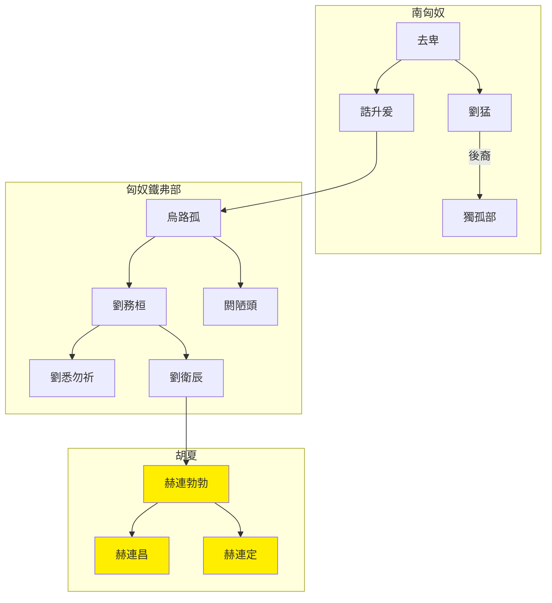

---
export_on_save:
    html: true
---

# 胡夏世系圖表

## 世系表

@import "胡夏世系表.csv"

## 世系圖

- 源於南匈奴去卑，後代分化為獨孤部與鐵弗部
- 烏路孤建立匈奴鐵弗部
- 劉衛辰反復於秦魏間，最終被北魏殺，幼子劉勃勃(赫連勃勃)逃亡
- 赫連勃勃逃亡後秦，後秦通好北魏而叛，建立胡夏
- 413年築統萬城，改姓赫連

