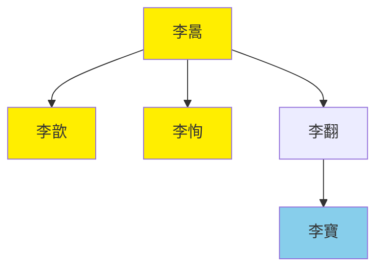

---
export_on_save:
    html: true
---

# 西涼世系圖表

## 世系表

@import "西涼世系表.csv"

## 世系圖

- 李暠因為白額駒讖言，從北涼分化出來建立西涼
- 李歆執意攻打北涼反被滅
- 北魏滅北涼後，李寶建立後西涼割據20年，終降北魏
- 湊數政權，能上榜主要因為是隴西李氏先祖，被唐朝追認

```mermaid
graph TB

李暠-->李歆
李暠-->李恂
李暠-->李翻

李翻-->李寶

classDef king fill:#ffee00
class 李暠,李歆,李恂 king

classDef semiking fill:#87CEEB
class 李寶 semiking
```