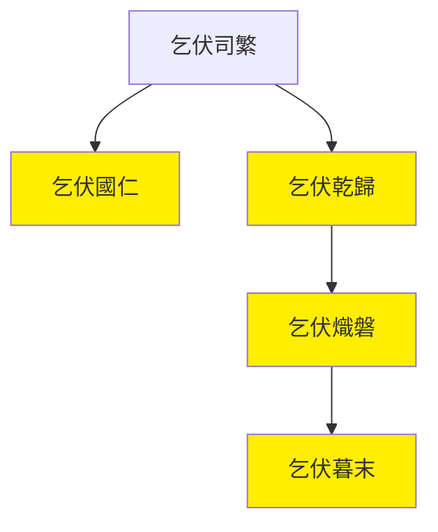

---
export_on_save:
    html: true
---

# 西秦世系圖表

## 世系表

@import "西秦世系表.csv"

## 世系圖

- 前身為[乞伏鮮卑](2_世系圖表/2.2_并立政權/晉/乞伏鮮卑世系圖表.html)

```mermaid
graph TB

乞伏司繁-->乞伏國仁
乞伏司繁-->乞伏乾歸
乞伏乾歸-->乞伏熾磐
乞伏熾磐-->乞伏暮末

classDef king fill:#ffee00
class 乞伏國仁,乞伏乾歸,乞伏熾磐,乞伏暮末 king
```