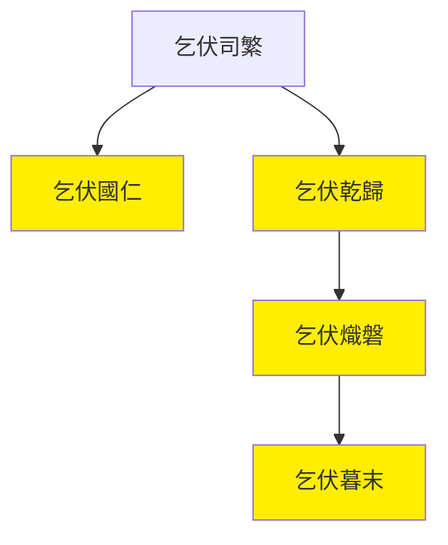
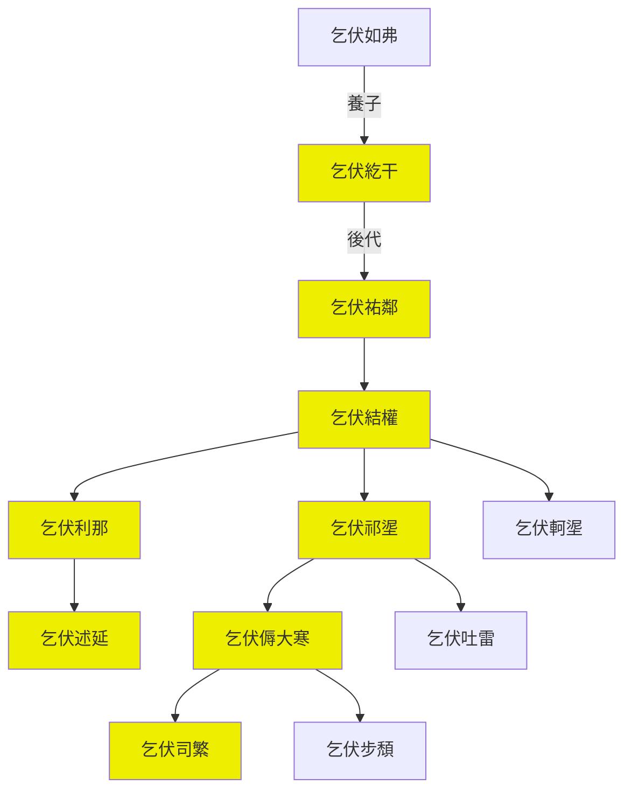

---
export_on_save:
    html: true
---

# 西秦世系圖表

## 世系表

@import "西秦世系表.csv"

## 世系圖
- 僅乞伏乾歸、乞伏熾磐稍有建樹
- 乞伏熾磐後期與北涼互相攻伐，國力漸弱，可謂被打得滿地找牙，最後在投降北魏的路上被即將滅亡的胡夏攻滅，唯一的忠臣焦遺欲東山再起而病卒

```mermaid
graph TB

乞伏司繁-->乞伏國仁
乞伏司繁-->乞伏乾歸
乞伏乾歸-->乞伏熾磐
乞伏熾磐-->乞伏暮末

classDef king fill:#ffee00
class 乞伏國仁,乞伏乾歸,乞伏熾磐,乞伏暮末 king
```

- 前身乞伏鮮卑世系圖

```mermaid
graph TB

乞伏如弗--養子-->乞伏紇干
乞伏紇干--後代-->乞伏祐鄰
乞伏祐鄰-->乞伏結權

乞伏結權-->乞伏利那
乞伏結權-->乞伏祁埿
乞伏結權-->乞伏軻埿

乞伏利那-->乞伏述延

乞伏祁埿-->乞伏傉大寒
乞伏祁埿-->乞伏吐雷

乞伏傉大寒-->乞伏司繁
乞伏傉大寒-->乞伏步頹

classDef king fill:#EEEE00
class 乞伏紇干,乞伏祐鄰,乞伏結權,乞伏利那,乞伏祁埿,乞伏述延,乞伏傉大寒,乞伏司繁 king
```