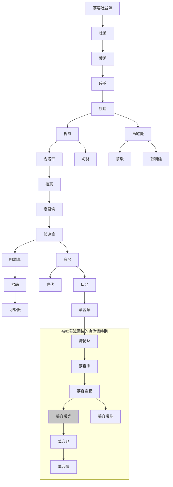

---
export_on_save:
    html: true
---

# 吐谷渾世系圖表

## 世系表

@import "吐谷渾世系表.csv"

## 世系圖

- 祖先為西晉時期慕容涉歸庶長子慕容吐谷渾，與慕容廆鬧矛盾自立門戶

```mermaid
graph TB

慕容吐谷渾-->吐延
吐延-->葉延
葉延-->碎奚
碎奚-->視連
視連-->視羆
視連-->烏紇提

視羆-->樹洛干
視羆-->阿豺
烏紇提-->慕璝
烏紇提-->慕利延

樹洛干-->拾寅
拾寅-->度易侯
度易侯-->伏連籌

伏連籌-->呵羅真
伏連籌-->夸呂
呵羅真-->佛輔
佛輔-->可沓振

夸呂-->世伏
夸呂-->伏允
伏允-->慕容順
慕容順-->諾曷缽

subgraph 被吐蕃滅國後的唐傀儡時期
    諾曷缽-->慕容忠
    慕容忠-->慕容宣超
    慕容宣超-->慕容曦光
    慕容宣超-->慕容曦皓
    慕容曦光-->慕容兆
    慕容兆-->慕容復
end

classDef passing fill:#c6c6c6
class 慕容曦光 passing
```