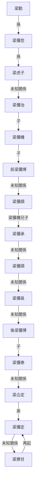

---
export_on_save:
    html: true
---

# 宕昌國世系圖表

- 甘南宕昌羌所建立，通鑑首次記載為劉宋初期的梁彌忽
- 宕昌國被北周武帝滅

```mermaid
graph TB
梁勤--孫-->梁彌忽
梁彌忽--孫-->梁虎子
梁虎子--未知關係-->梁彌治
梁彌治--子-->梁彌機
梁彌機--子-->前梁彌博
前梁彌博--未知關係-->梁彌頡
梁彌頡--梁彌機兄子-->梁彌承
梁彌承--未知關係-->梁彌頜
梁彌頜--未知關係-->梁彌邕
梁彌邕--未知關係-->後梁彌博
後梁彌博--子-->梁彌泰
梁彌泰--未知關係-->梁仚定
梁仚定--弟-->梁彌定
梁彌定--未知關係-->梁獠甘
梁獠甘--再起-->梁彌定
```