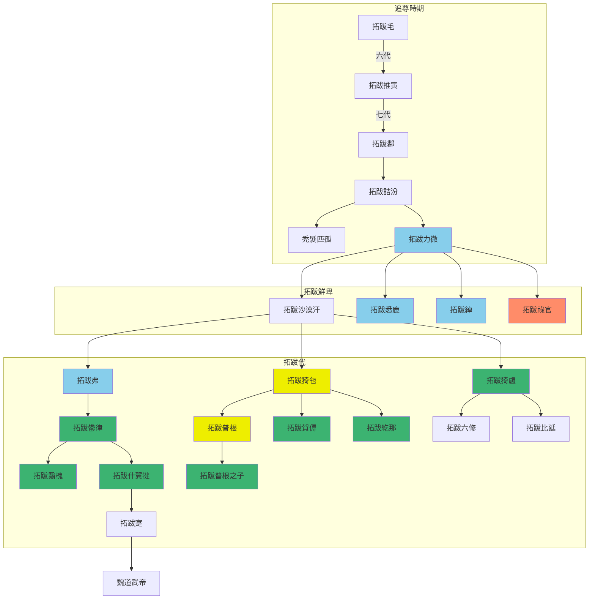
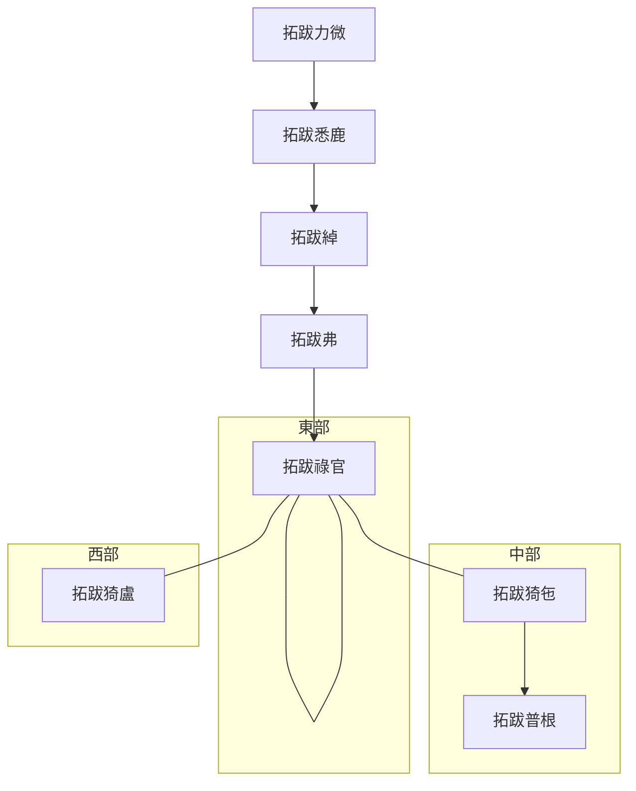
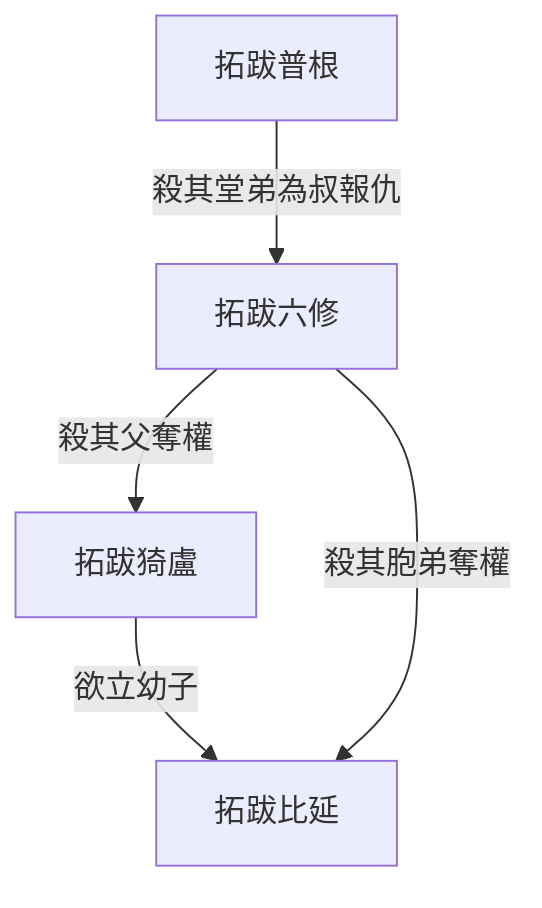

---
export_on_save:
    html: true
---

# 拓跋鮮卑-拓跋代世系圖表

## 世系表
- 北魏政權建立前世系，含追尊時期、拓跋鮮卑時期、拓跋代時期

@import "拓跋鮮卑-拓跋代世系表.csv"

## 世系圖

- 拓跋祿官分國三部，東中西分別用紅黃緑三色區分。拓跋猗盧之後統一建立拓跋代，仍沿用緑色
- 禿髮匹孤分化為河西鮮卑，為南涼的始祖

## 拓跋鮮卑傳位圖

## 拓跋猗盧政變圖

