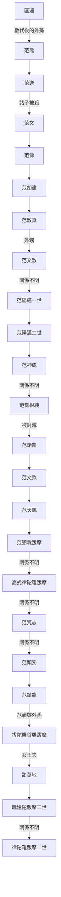

---
export_on_save:
    html: true
---

- 林邑王國（占婆第一王朝至第四王朝），192-757

- 傳位圖

```mermaid
graph TB

區連--數代後的外孫-->范熊
范熊-->范逸
范逸--諸子被殺-->范文
范文-->范佛
范佛-->范胡達
范胡達-->范敵真
范敵真--外甥-->范文敵
范文敵--關係不明-->范陽邁一世
范陽邁一世-->范陽邁二世
范陽邁二世-->范神成
范神成--關係不明-->范當根純
范當根純--被討滅-->范諸農
范諸農-->范文款
范文款-->范天凱
范天凱-->范弼毳跋摩
范弼毳跋摩--關係不明-->高式律陀羅跋摩
高式律陀羅跋摩--關係不明-->范梵志
范梵志--關係不明-->范頭黎
范頭黎-->范鎮龍
范鎮龍--范頭黎外孫-->拔陀羅首羅跋摩
拔陀羅首羅跋摩--女王夫-->諸葛地
諸葛地-->毗建陀跋摩二世
毗建陀跋摩二世--關係不明-->律陀羅跋摩二世

```