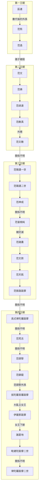

---
export_on_save:
    html: true
---

- 占族人在越南中部建立占婆國
    - 林邑時期 137-757：從東漢開始，建立前四個王朝，成為林邑王國
    - 占城時期 758-1832：唐朝中期，改名環王，成為占城國。一直延續至清朝，被越南兼併。
    - 早期信奉婆羅門教，13世紀部分改信伊斯蘭教
- 林邑王國（占婆第一王朝至第四王朝），192-757
    - 第一王朝：137-336，區連獨立自東漢，至東晉范逸死
    - 第二王朝：336-420，范文奪位，其中范胡達較強盛，至晉亡之年范文敵被殺
    - 第三王朝：420-六世紀前半葉，范陽邁一世建國，至南朝梁陳間范弼毳跋摩
    - 第四王朝：六世紀前半葉-757，高式律陀羅跋摩建立第四王朝，至唐朝律陀羅跋摩二世，改國號為環王

- 傳位圖
