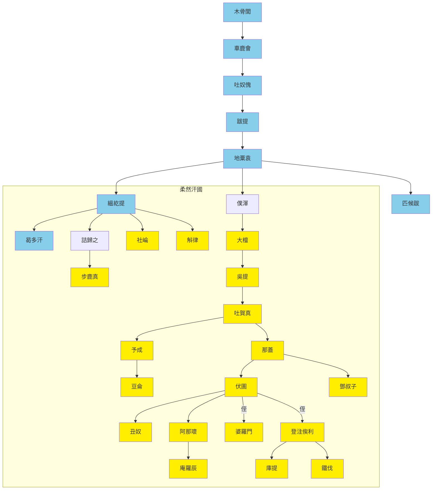

---
export_on_save:
    html: true
---

# 柔然世系圖表

## 世系表

@import "柔然世系表.csv"

## 世系圖
- 源於東胡，附於拓跋鮮卑
- 地粟袁之子分裂為東西兩部，但均被魏道武帝滅
- 社崘從北魏逃跑成功，開疆拓土，成為第一代柔然可汗
- 被突厥滅

```mermaid
graph TB

木骨閭-->車鹿會
車鹿會-->吐奴傀
吐奴傀-->跋提
跋提-->地粟袁
地粟袁-->匹候跋
地粟袁-->縕紇提
地粟袁-->僕渾

subgraph 柔然汗國
    縕紇提-->曷多汗
    縕紇提-->詰歸之
    縕紇提-->社崘
    縕紇提-->斛律

    詰歸之-->步鹿真
    
    僕渾-->大檀
    大檀-->吳提
    吳提-->吐賀真
    吐賀真-->予成
    予成-->豆侖
    吐賀真-->那蓋
    那蓋-->伏圖
    伏圖-->丑奴
    伏圖-->阿那瓌
    伏圖--侄-->婆羅門
    
    阿那瓌-->庵羅辰

    伏圖--侄-->登注俟利
    登注俟利-->庫提
    登注俟利-->鐵伐

    那蓋-->鄧叔子
end

classDef semi fill:#87CEEB
class 木骨閭,車鹿會,吐奴傀,跋提,地粟袁,匹候跋,縕紇提,曷多汗 semi

classDef king fill:#ffee00
class 社崘,斛律,步鹿真,大檀,吳提,吐賀真,予成,豆侖,那蓋,伏圖,丑奴,阿那瓌,婆羅門,鐵伐,登注俟利,庫提,庵羅辰,鄧叔子 king
```