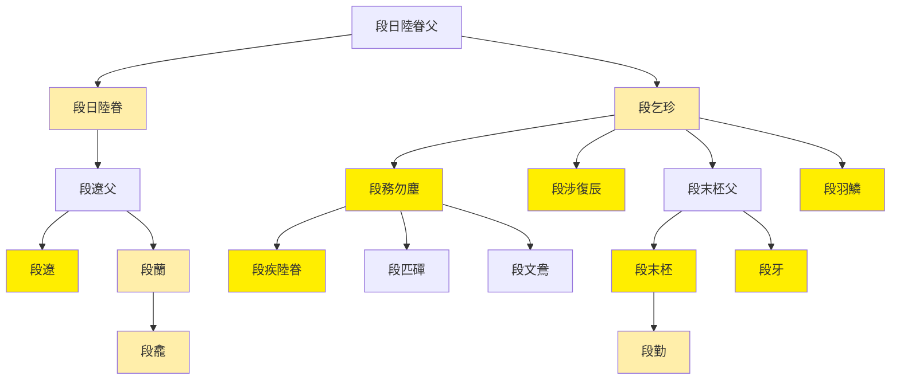

---
export_on_save:
    html: true
---

# 段部鮮卑世系圖表

## 世系表

@import "段部鮮卑世系表.csv"

## 世系圖

- 段務勿塵至段遼，為相對正統的遼西公階段
- 段蘭被石虎復國，後段龕建立段齊
- 段勤受冉閔影響短暫稱帝，秒降前燕

```mermaid
graph TB

段日陸眷父-->段日陸眷
段日陸眷父-->段乞珍

段日陸眷-->段遼父

段遼父-->段遼
段遼父-->段蘭

段蘭-->段龕

段乞珍-->段務勿塵
段乞珍-->段涉復辰
段乞珍-->段末柸父
段乞珍-->段羽鱗

段務勿塵-->段疾陸眷
段務勿塵-->段匹磾
段務勿塵-->段文鴦

段末柸父-->段末柸
段末柸父-->段牙

段末柸-->段勤

classDef king fill:#ffee00
class 段務勿塵,段疾陸眷,段涉復辰,段羽鱗,段末柸,段牙,段遼 king

classDef semiking fill:#ffeeaa
class 段日陸眷,段乞珍,段蘭,段龕,段勤 semiking
```