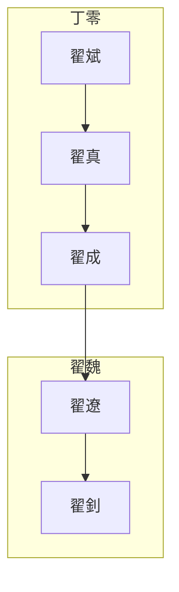
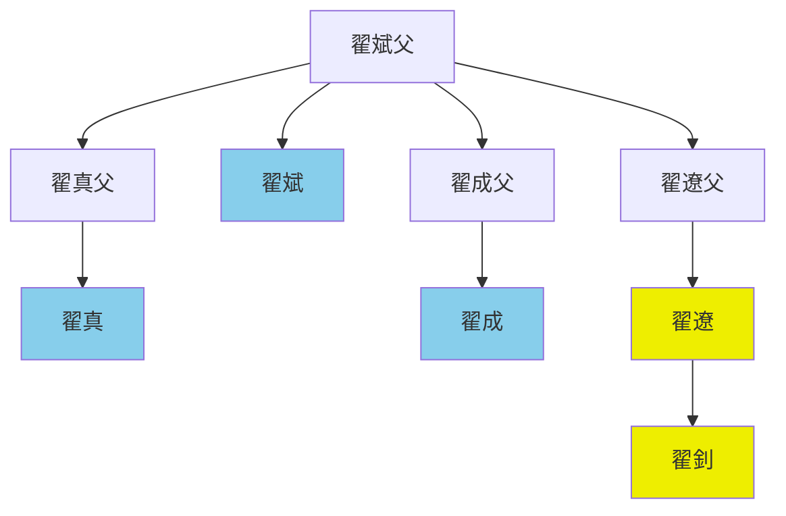

---
export_on_save:
    html: true
---

# 翟魏世系圖表

- 傳位圖
    - 日常性反復無常，388年慕容垂怒斬翟遼使者，翟遼索性自立門戶，自稱魏天王
    - 翟釗被東晉、後燕攻，投奔西燕謀反被誅

```mermaid
graph TB

subgraph 丁零
    翟斌-->翟真-->翟成
end
subgraph 翟魏
    翟成-->翟遼-->翟釗
end
```

- 世系圖

```mermaid
graph TB

翟斌父-->翟真父
翟斌父-->翟斌
翟斌父-->翟成父
翟斌父-->翟遼父

翟真父-->翟真
翟成父-->翟成
翟遼父-->翟遼

翟遼-->翟釗

classDef dingling fill:#87CEEB
class 翟斌,翟真,翟成 dingling

classDef king fill:#EEEE00
class 翟遼,翟釗 king
```