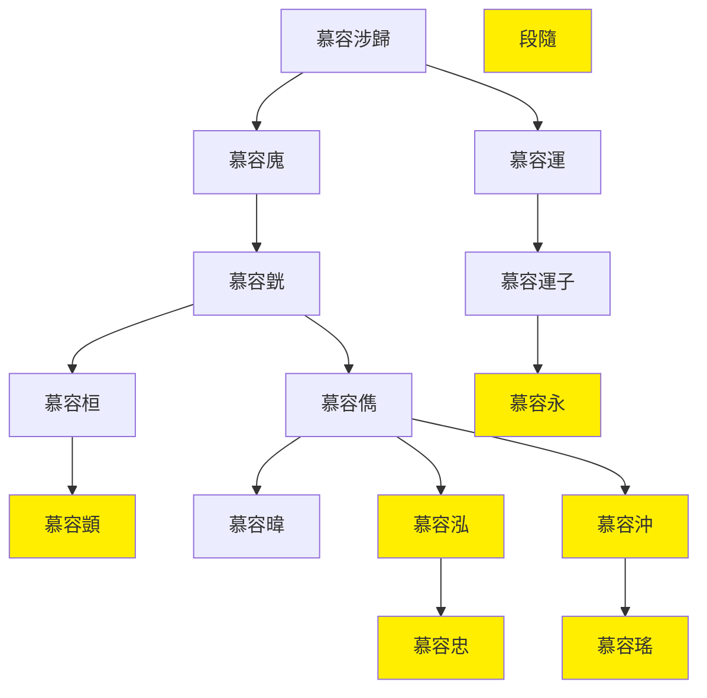

---
export_on_save:
    html: true
---

# 西燕世系圖表

## 世系表

@import "西燕世系表.csv"

## 世系圖

- 淝水之戰后慕容泓為復興燕國的分支，稱濟北王
- 高蓋殺慕容泓立慕容沖，慕容沖稱帝，定都阿房
- 段隨殺慕容沖，慕容永等策劃殺段隨立慕容顗
- 慕容顗被其弟殺，立慕容瑤
- 慕容永殺慕容瑤立慕容忠
- 慕容忠被部下殺，慕容永稱帝於長子，被後燕滅

