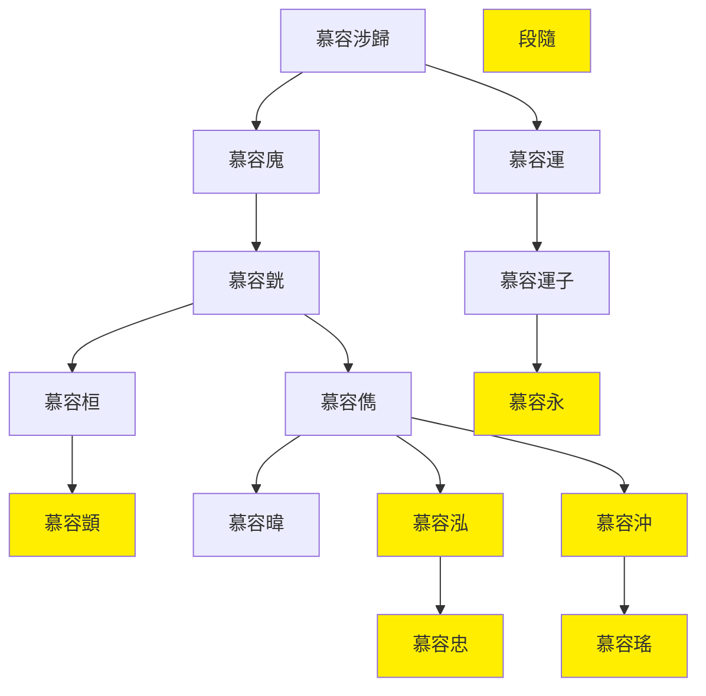

---
export_on_save:
    html: true
---

# 西燕世系圖表

## 世系表

@import "西燕世系表.csv"

## 世系圖

- 淝水之戰后慕容泓為復興燕國的分支，稱濟北王
- 384年，高蓋殺慕容泓立慕容沖
- 慕容沖稱帝，定都阿房，後攻破長安，趕走前男友苻堅
- 386年五連殺
    - 慕容沖搞經濟不復國，韓延殺慕容沖(X1)，立段隨
    - 慕容恆慕容永殺段隨(X2)，立慕容顗，去長安東行
    - 慕容韜殺慕容顗(X3)，慕容恆立慕容瑤
    - 群眾皆奔慕容永，慕容永殺慕容瑤(X4)，立慕容忠
    - 刁雲殺慕容忠(X5)，推舉慕容永
- 慕容永擊敗苻丕，稱帝於長子，被後燕滅

