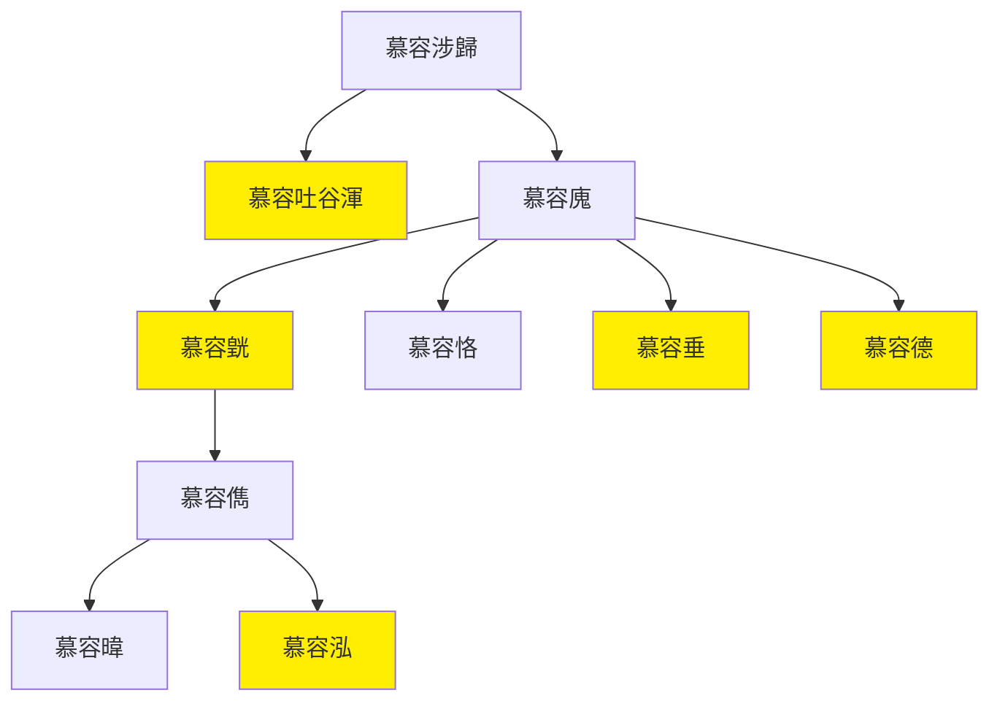

---
export_on_save:
    html: true
---

# 諸慕容政權總圖

- [慕容鮮卑](慕容鮮卑世系圖表.html)：諸慕容政權建立前世系
- 吐谷渾：慕容吐谷渾313年建立，斷續存在至唐朝，663年滅亡
- [前燕](十六國/前燕世系圖表.html)：慕容廆奠基，慕容皝337年建立，後期主要靠慕容恪，370年被前秦滅
- [後燕](十六國/後燕世系圖表.html)：慕容垂384年建立，被北魏大幅度削弱，407/409年被北燕滅
- [西燕](西燕世系圖表.html)：慕容泓384年建立，一年死五帝，394年被後燕滅，十六國之外
- [南燕](十六國/南燕世系圖表.html): 慕容德398年建立，410年被南朝宋滅
- [北燕](十六國/北燕世系圖表.html)：407/409年建立，延續後燕政權，但為漢/高句麗所建，非慕容氏

