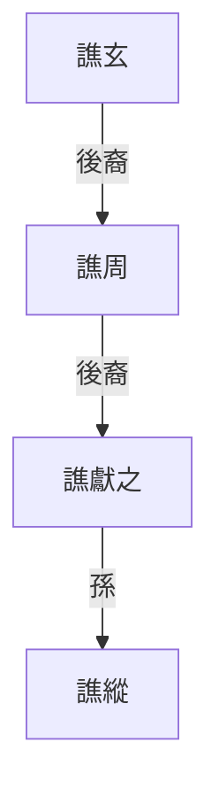

---
export_on_save:
    html: true
---

# 譙蜀世系圖表

- 桓玄之亂的蝴蝶效應，引發蜀地自治，稱譙蜀、西蜀、後蜀
- 405年譙縱被強推上臺，413年被東晉滅
- 巴西譙氏世系
    - 譙玄：兩漢之交，隱士，忠於大漢
    - 譙周：蜀漢，立主劉禪投降
    - 譙獻之：成漢，為司空
    - 譙縱：譙蜀，被逼上位，對抗東晉

```mermaid
graph TB

譙玄--後裔-->譙周
譙周--後裔-->譙獻之
譙獻之--孫-->譙縱

```