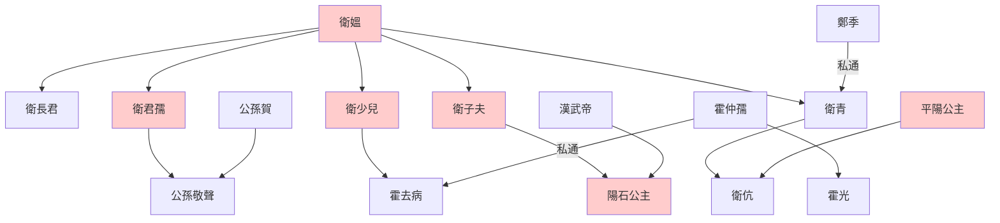
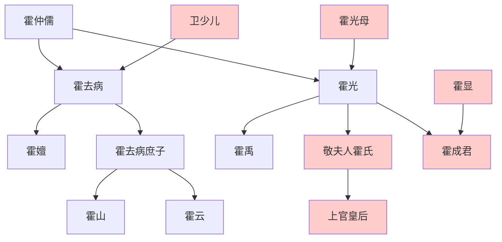
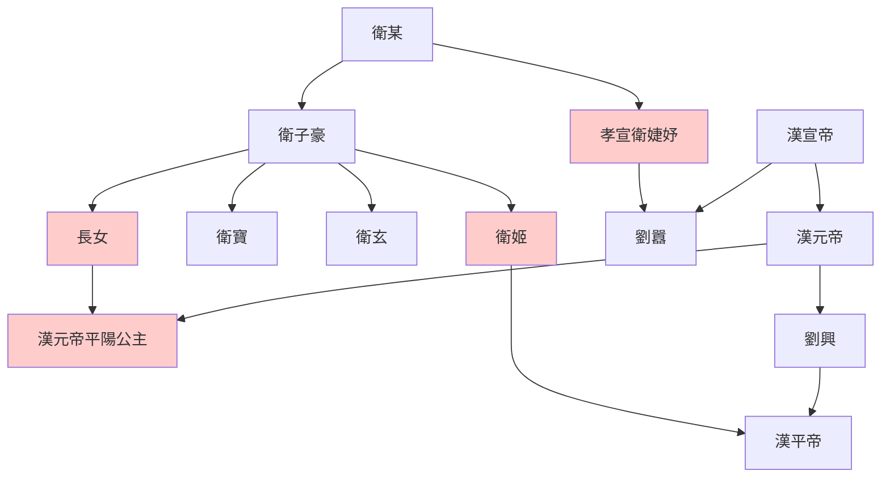

---
export_on_save:
    html: true
---

# 衛霍世系圖表

## 衛霍裙帶世系

- 另：曹時與平陽公主子曹襄，尚漢武帝與衛子夫女衛長公主

```mermaid
graph TB
衛媼-->衛長君
衛媼-->衛君孺
衛媼-->衛少兒
衛媼-->衛子夫
衛媼-->衛青
鄭季--私通-->衛青
衛君孺-->公孫敬聲
公孫賀-->公孫敬聲
衛少兒-->霍去病
霍仲孺--私通-->霍去病
霍仲孺-->霍光
衛子夫-->陽石公主
漢武帝-->陽石公主
衛青-->衛伉
平陽公主-->衛伉

classDef female fill:#ffcccc
class 衛媼,衛君孺,衛少兒,衛子夫,陽石公主,平陽公主 female
```

## 霍光世系

```mermaid
graph TB
霍仲儒-->霍去病
卫少儿-->霍去病
霍仲儒-->霍光
霍光母-->霍光
霍去病-->霍嬗
霍去病-->霍去病庶子
霍去病庶子-->霍山
霍去病庶子-->霍云
霍光-->霍禹
霍光-->敬夫人霍氏
敬夫人霍氏-->上官皇后
霍光-->霍成君
霍显-->霍成君

classDef female fill:#ffcccc
class 卫少儿,霍光母,霍显,霍成君,敬夫人霍氏,上官皇后 female

```

## 衛子夫後衛氏世系

```mermaid
graph TB
衛某-->衛子豪
衛某-->孝宣衛婕妤

衛子豪-->長女
衛子豪-->衛寶
衛子豪-->衛玄
衛子豪-->衛姬

孝宣衛婕妤-->劉囂
漢宣帝-->劉囂
漢宣帝-->漢元帝

長女-->漢元帝平陽公主
漢元帝-->漢元帝平陽公主
漢元帝-->劉興

衛姬-->漢平帝
劉興-->漢平帝

classDef female fill:#ffcccc
class 孝宣衛婕妤,長女,衛姬,漢元帝平陽公主 female
```