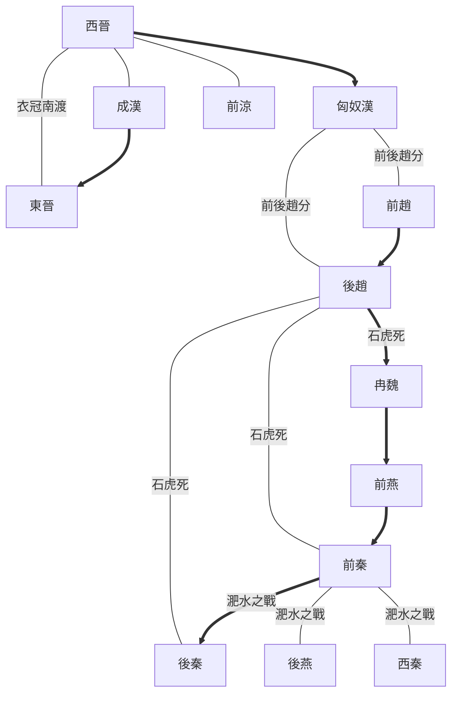

---
export_on_save:
  html: true
---

# 淝水之戰前政權形勢

## 晉朝淝水之戰前北方中原權力裂變
- 西晉滅亡：[匈奴漢]劉淵攻[西晉]，劉聰滅[西晉]
- 前後趙分：劉聰死，裂變出[前趙]劉曜、[後趙]石勒
- 後趙滅前趙：石勒滅[前趙]劉曜，傳石虎
- 石虎暴政：石虎死，裂變出[冉魏]冉閔、[前秦]前身苻洪、[後秦]前身姚弋仲
- 冉魏篡後趙：冉閔頒佈殺胡令，篡[後趙]稱帝
- 前燕滅冉魏：冉閔攻殺後趙殘餘，[前燕]慕容儁滅[冉魏]冉閔
- 前秦滅前燕：慕容恪死後，苻堅滅[前燕]慕容暐
- 淝水之戰：[東晉]謝安敗[前秦]苻堅，裂變出[後燕]慕容垂、[後秦]姚萇，以及各國蠢動如[西秦]、[北魏]等

## 淝水之戰前政權形勢圖
