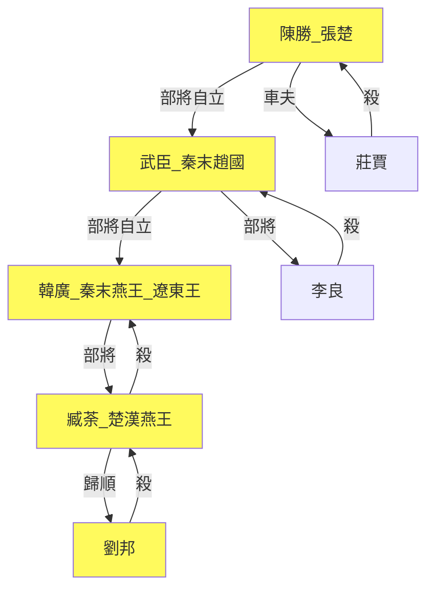

---
export_on_save:
    html: true
---

# 秦末漢初政權逗逼分裂圖

```mermaid
graph TB
陳勝_張楚--部將自立-->武臣_秦末趙國
武臣_秦末趙國--部將自立-->韓廣_秦末燕王_遼東王
韓廣_秦末燕王_遼東王--部將-->臧荼_楚漢燕王

陳勝_張楚--車夫-->莊賈
莊賈--殺-->陳勝_張楚
武臣_秦末趙國--部將-->李良
李良--殺-->武臣_秦末趙國
臧荼_楚漢燕王--殺-->韓廣_秦末燕王_遼東王
臧荼_楚漢燕王--歸順-->劉邦
劉邦--殺-->臧荼_楚漢燕王

classDef king fill:#fffa5d
class 陳勝_張楚,武臣_秦末趙國,韓廣_秦末燕王_遼東王,臧荼_楚漢燕王,劉邦 king

```