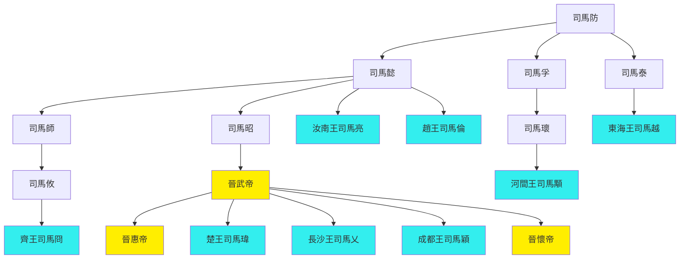
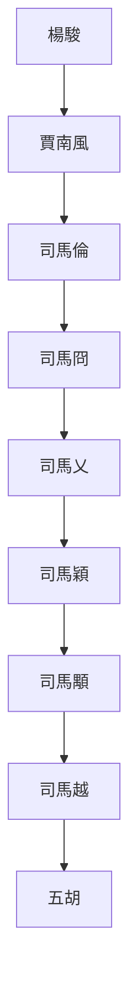

---
export_on_save:
  html: true
---

## 八王之亂始末
- 第一亂：賈南風除楊駿 291
  - 死亡：司馬亮、司馬瑋；受益人、黑馬：賈南風；暗雷：司馬遹
  - 司馬炎死，欲托孤司馬亮不得，楊駿專權，排擠司馬亮
  - 賈南風欲除楊駿及太后黨，矯詔使司馬瑋進京討伐
  - 楊駿怯懦，賈南風終殺三楊及其黨羽，廢太后
  - 司馬亮衛瓘欲除司馬瑋，賈南風授意司馬瑋矯詔反殺之
  - 賈南風以司馬瑋矯詔為罪名除之，為司馬亮衛瓘平反，大權在握
  - 賈南風以張華裴頠輔政，9年無事
- 第二亂：司馬倫除賈南風 300
  - 死亡：賈南風、司馬遹；受益人：司馬倫；暗雷：司馬冏
  - 賈南風與太子司馬遹矛盾激化而廢之，張華裴頠戀位沉默
  - 司馬倫應反對黨邀請欲除賈后，孫秀獻計使兩敗俱傷，反間使賈南風殺司馬遹
  - 司馬倫殺賈南風，清洗其黨羽，孫秀掌實權
  - 司馬允討逆失敗被殺；司馬冏對分封不滿
- 第三亂：三王除司馬倫 301
  - 死亡：司馬倫；受益人：司馬冏；暗雷：司馬穎、司馬顒
  - 司馬倫加九錫，篡位稱帝，狗尾續貂，與孫秀亂政
  - 司馬冏首發檄文，冏穎顒三王起兵誅孫秀司馬倫，各懷鬼胎但最終勝利
  - 賜死司馬倫，晉惠帝復位
  - 三王論功，司馬穎自請歸國，司馬冏執掌大權
- 第四亂：司馬乂殺司馬冏 303
  - 死亡：司馬冏；受益人：司馬穎；黑馬：司馬乂；暗雷：司馬顒
  - 司馬蕤聯合王輿，欲誅司馬冏被反殺
  - 司馬冏執掌大權，招攬人才，開始驕奢淫逸，人才又去
  - 司馬顒納李含諫，發檄文討伐司馬冏，欲借司馬冏刀殺司馬乂，再改立司馬穎
  - 司馬冏司馬乂宮內開戰，大亂三日，司馬乂持晉惠帝，最終竟斬司馬冏
  - 司馬穎鄴城遙控司馬乂，成為實際掌權者
- 第五亂：司馬乂不敗而被陰 304
  - 死亡：司馬乂；受益人：司馬穎；黑馬：司馬越；暗雷：司馬顒、司馬越
  - 司馬穎司馬乂鬧翻，在外李特六郡流民起義、張昌之亂迭起
  - 因李含與皇甫商不合，司馬顒使之謀殺司馬乂未遂反被殺
  - 司馬顒起兵七萬討伐司馬乂，司馬穎響應二十萬，司馬乂攜晉惠帝禦之
  - 司馬乂戰勝，陸機死張方退。司馬乂求與司馬穎和解不從
  - 司馬乂不敗，而糧草不足。司馬越擔心最終受牽連，夜收司馬乂置金墉城，借張方手焚之
  - 司馬穎成功上位，仍在鄴城遙控，司馬越進爵
- 第六亂：司馬穎逃跑 304
  - 死亡：無；受益人、黑馬：張方；暗雷：五胡
  - 司馬穎廢羊獻容，被立為皇太弟，制度效法曹操
  - 司馬穎僭越驕奢，司馬越復羊獻容，起兵討伐
  - 司馬越蕩陰之戰奉帝北征，司馬穎敗之而得晉惠帝，遷置鄴城
  - 司馬穎因舊怨討王浚，王浚聯合五胡起兵。劉淵藉口助討王浚，脫離司馬穎還匈奴
  - 王浚攻破鄴城大掠，司馬穎逃跑。帝移洛陽，被張方接手
  - 氐族李雄稱成都王，匈奴劉淵建國稱漢王，五胡亂華開始
- 第七亂：顒越亂鬥 306
  - 死亡：張方；受益人：司馬越；暗雷：五胡
  - 張方劫遷車駕，挾晉惠帝至長安
  - 司馬顒為和解諸王，廢司馬穎，改立司馬熾為皇太弟
  - 司馬越傳檄討伐張方，還帝洛陽，被推為盟主
  - 司馬顒司馬越開始派系亂鬥，司馬越派系司馬虓劉琨兄弟，司馬顒派系劉喬等，司馬穎成為司馬顒小弟
  - 司馬顒欲與司馬越和解，張方堅決主戰，司馬顒殺之，傳首司馬越請和被拒
  - 司馬越引鮮卑兵，司馬顒被打殘，司馬越奉帝還洛陽
  - 南方陳敏反叛自立為楚公，陳伯根反，五苓夷亂，均平
- 第八亂：司馬越專權 307
  - 死亡：司馬穎、司馬衷、司馬顒；受益人：司馬越；暗雷：五胡
  - 司馬穎逃亡中被司馬虓執，劉輿殺之
  - 司馬越掌控大權，毒死晉惠帝，立晉懷帝為傀儡
  - 司馬越誅司馬顒
  - 李雄稱帝，石勒王彌等投劉淵，五胡之亂勢成
- 後續：司馬越死及永嘉之亂 311
  - 死亡：司馬越；受益人：五胡
  - 晉懷帝親政，司馬越不滿，出鎮許昌
  - 汲桑叛亂，擡出司馬穎棺材膜拜，汲桑死後棺材被扔井中
  - 晉朝政愈亂，屢遭漢趙攻擊，司馬越與苟晞不合，憂懼而死，石勒挫骨揚灰
  - 接續永嘉之亂，晉懷帝及百官被漢趙擄走

## 八王之亂關鍵人物表

姓名|爵位|關係|卒年|分類|關鍵詞|事跡
--|--|--|--|--|--|--|--
司馬亮|汝南王|司馬懿子|291|八王|悲情託孤人|司馬炎欲托孤被楊駿排擠，楊駿除後被司馬瑋殺
司馬瑋|楚王|司馬炎子|291|八王|賈南風棋子|賈南風使進京誅楊駿，借刀殺司馬亮而後被誅
司馬倫|趙王|司馬懿子|301|八王|低能野心家|主持誅除賈南風，成功後篡位稱帝，被三王起義敗後賜死
司馬冏|齊王|司馬師孫，實際司馬昭|303|八王|低能野心家|共誅賈南風有功無賞，三王起義首發檄文討伐司馬倫，成功後掌權驕奢，被司馬乂誅
司馬穎|成都王|司馬炎子|306|八王|重兵遙控王|掌重兵，三王起義興重兵討伐司馬倫，成功後歸藩以收買人心，討敗司馬冏後遙控政局，被司馬越王浚敗，逃亡途中死
司馬顒|河間王|司馬孚孫|306|八王|猶豫和事佬、張方吉祥物|三王起義猶豫不決而終共討司馬倫，首發檄文討伐司馬冏，推舉司馬穎而部下張方失控，殺張方司馬越不領情，終被殺
司馬乂|長沙王|司馬炎子|304|八王|忠良戰神|從司馬穎共討伐司馬倫，司馬冏掌權驕奢而除之，初服從司馬穎後與決裂，顒穎聯合攻之不勝，被司馬越收，借張方手炙殺
司馬越|東海王|司馬防孫，司馬泰子|311|八王|戰五渣漁翁|顒穎攻乂時，擔心司馬乂兵敗受牽連，夜收金墉城，借張方手殺之，討伐司馬穎不敵，為盟主引五胡攻張方司馬顒，最終勝出八王之亂，毒殺晉惠帝，與苟晞不合永嘉之亂死
司馬炎|晉武帝|司馬昭子|290|皇帝||過度分封諸王，選太子失誤，死前託孤失敗，種八王之亂因
司馬衷|晉惠帝|司馬炎子|307|皇帝|親征坦克帝|昏庸無能，八王之亂主因
司馬熾|晉懷帝|司馬炎子|313|皇帝||八王之亂後司馬越傀儡
司馬遹||司馬衷子|300|宗室||原隔代儲君，被賈南風廢殺
賈南風|皇后|司馬衷后|300|賈后黨||挑起第一亂除楊駿殺二王掌權，第二亂殺司馬遹被司馬倫殺
孫秀|||301|司馬倫黨|司馬倫本體|司馬倫核心心腹，實際掌權者，同被誅
張方|||306|司馬顒黨|司馬顒本體、食人魔|司馬顒大將，不敵司馬乂，借機炙殺之，掌司馬顒實權，被殺賣給司馬越不收
王浚|||314|司馬越黨|五胡帶路黨|引五胡破司馬穎，首批五胡帶路黨
羊獻容|皇后|司馬衷后|322||萬能工具人|五廢六立
張華|||300|賈后黨||盡心治國，貪戀權位，牽連賈后被殺
盧志|||312|司馬穎黨||司馬穎謀主，保持忠誠，活過八王之亂
李含|||303|司馬顒黨|挑事小弟|設計借司馬冏刀殺司馬乂失敗，敵對皇甫商，使顒乂破裂引發第五亂
皇甫商|||303|司馬乂黨|挑事小弟|本為司馬冏黨，告發李含等謀殺事，使顒乂破裂引發第五亂

## 八王之亂人物關係圖

## 八王之亂權力接力棒

