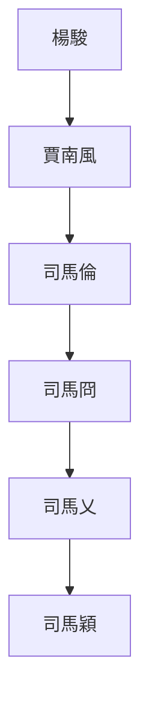

---
export_on_save:
  html: true
---

## 八王之亂始末
- 第一亂：賈南風除楊駿291
  - 死亡：司馬亮、司馬瑋；受益人、黑馬：賈南風；暗雷：司馬遹
  - 司馬炎死，欲托孤司馬亮不得，楊駿專權，排擠司馬亮
  - 賈南風欲除楊駿及太后黨，矯詔使司馬瑋進京討伐
  - 楊駿怯懦，賈南風終殺三楊及其黨羽，廢太后
  - 司馬亮衛瓘欲除司馬瑋，賈南風授意司馬瑋矯詔反殺之
  - 賈南風以司馬瑋矯詔為罪名除之，為司馬亮衛瓘平反，大權在握
  - 賈南風以張華裴頠輔政，9年無事
- 第二亂：司馬倫除賈南風300
  - 死亡：賈南風、司馬遹；受益人：司馬倫；暗雷：司馬冏
  - 賈南風與太子司馬遹矛盾激化而廢之，張華裴頠戀位沉默
  - 司馬倫應反對黨邀請欲除賈后，孫秀獻計使兩敗俱傷，反間使賈南風殺司馬遹
  - 司馬倫殺賈南風，清洗其黨羽，孫秀掌實權
  - 司馬允討逆失敗被殺；司馬冏對分封不滿
- 第三亂：三王除司馬倫301
  - 死亡：司馬倫；受益人：司馬冏；暗雷：司馬穎、司馬顒
  - 司馬倫加九錫，篡位稱帝，狗尾續貂，與孫秀亂政
  - 司馬冏首發檄文，冏穎顒三王起兵誅孫秀司馬倫，各懷鬼胎但最終勝利
  - 賜死司馬倫，晉惠帝復位
  - 三王論功，司馬穎自請歸國，司馬冏執掌大權
- 第四亂：除司馬冏303
  - 死亡：司馬冏；受益人：司馬穎；黑馬：司馬乂；暗雷：司馬顒
  - 司馬蕤聯合王輿，欲誅司馬冏被反殺
  - 司馬冏執掌大權，招攬人才，開始驕奢淫逸，人才又去
  - 司馬顒納李含諫，發檄文討伐司馬冏，欲借司馬冏刀殺司馬乂，再改立司馬穎
  - 司馬冏司馬乂宮內開戰，大亂三日，司馬乂持晉惠帝，最終竟斬司馬冏
  - 司馬穎鄴城遙控司馬乂，成為實際掌權者
- 第五亂：司馬乂不敗而被陰304
  - 死亡：司馬乂；受益人：司馬穎；黑馬：司馬越；暗雷：司馬顒、司馬越
  - 司馬穎司馬乂不合，在外李特六郡流民起義、張昌之亂迭起
  - 因李含與皇甫商不合，司馬顒使之謀殺司馬乂未遂反被殺
  - 司馬顒起兵七萬討伐司馬乂，司馬穎響應二十萬，司馬乂攜晉惠帝禦之
  - 司馬乂戰勝，陸機死張方退。司馬乂求與司馬穎和解不從
  - 司馬乂不敗，而糧草不足。司馬越擔心最終受牽連，夜收司馬乂置金墉城，借張方手殺之
  - 司馬穎成功上位，仍在鄴城遙控，司馬越進爵
- 第六亂：司馬穎
  - 司馬穎廢羊獻容，被立為皇太弟，制度效法曹操
  - 司馬穎僭越驕奢，司馬越復羊獻容，起兵討伐
  - 司馬越奉帝北征，被司馬穎敗
  - 司馬穎得晉惠帝，置鄴城
  - 王浚因舊仇聯合外族，起兵討伐司馬穎

## 八王之亂關鍵人物表

姓名|爵位|關係|卒年|分類|事跡
--|--|--|--|--|--
司馬亮|汝南王|司馬懿子|291|八王|司馬炎欲托孤被楊駿排擠，楊駿除後被司馬瑋殺
司馬瑋|楚王|司馬炎子|291|八王|賈南風使進京誅楊駿，借刀殺司馬亮而後被誅
司馬倫|趙王|司馬懿子|301|八王|主持誅除賈南風，成功後篡位稱帝，被三王起義敗後賜死
司馬冏|齊王|司馬師孫，實際司馬昭|303|八王|共誅賈南風有功無賞，三王起義首發檄文討伐司馬倫，成功後掌權驕奢，被司馬乂誅
司馬穎|成都王|司馬炎子||八王|三王起義興重兵討伐司馬倫，成功後歸藩以收買人心
司馬顒|河間王|司馬孚孫||八王|三王起義猶豫不決而終共討司馬倫，首發檄文討伐司馬冏
司馬乂|長沙王|司馬炎子|304|八王|晉室忠良，從司馬穎共討伐司馬倫，司馬冏掌權驕奢而除之，初服從司馬穎後與決裂，顒穎聯合攻之不勝，被司馬越收，借張方手炙殺
司馬越|東海王|司馬防孫，司馬泰子||八王|顒穎攻乂時，擔心司馬乂兵敗受牽連，夜收金墉城，借張方手殺之
司馬炎|晉武帝|司馬昭子|290|皇帝|過度分封諸王，選太子失誤，死前託孤失敗，種八王之亂因
司馬衷|晉惠帝|司馬炎子|307|皇帝|昏庸無能，八王之亂主因
司馬遹||司馬衷子|300|宗室|原隔代儲君，被賈南風廢殺
賈南風|皇后|司馬衷后|300|賈后黨|挑起第一亂除楊駿殺二王掌權，第二亂殺司馬遹被司馬倫殺
楊駿||司馬炎丈人|291|楊駿黨|司馬炎託孤，排擠司馬亮而專權，被賈南風殺
衛瓘|||291|功臣|功臣，親附司馬亮，欲除司馬瑋被反殺
張華|||300|賈后黨|盡心治國，貪戀權位，牽連賈后被殺
孫秀|||301|司馬倫黨|司馬倫核心心腹，實際掌權者，同被誅
張方||||司馬顒黨|司馬顒大將，不敵司馬乂，借機炙殺之
盧志||||司馬穎黨|司馬穎謀主，獻計歸藩休養生息
李含|||303|司馬顒黨|設計借司馬冏刀殺司馬乂失敗
皇甫商||||司馬乂黨|本為司馬冏黨，告發李含等謀殺事
司馬允|淮南王|司馬炎子|300|宗室|忠於宗室，有威望，討伐三楊，反司馬倫中計身死
司馬肜|梁王|司馬懿子||宗室|平庸宗室，誰也不得罪，保持爵位

## 八王之亂人物關係圖

- 八王之亂權力接力棒
