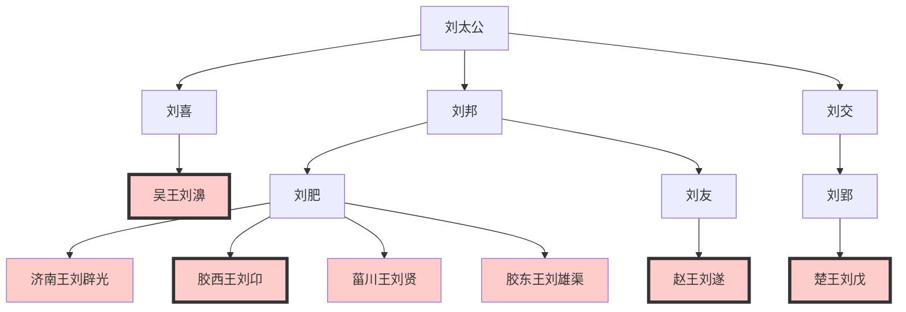

---
export_on_save:
    html: true
---

# 七國之亂關係圖

```mermaid
graph TB
刘太公-->刘喜
刘太公-->刘邦
刘太公-->刘交
刘喜-->吴王刘濞
刘交-->刘郢
刘郢-->楚王刘戊
刘邦-->刘肥
刘邦-->刘友
刘友-->赵王刘遂
刘肥-->济南王刘辟光
刘肥-->胶西王刘卬
刘肥-->菑川王刘贤
刘肥-->胶东王刘雄渠

classDef rebel fill:#ffcccc
class 吴王刘濞,楚王刘戊,赵王刘遂,济南王刘辟光,胶西王刘卬,菑川王刘贤,胶东王刘雄渠 rebel

classDef victim fill:#ffcccc,stroke:#333,stroke-width:4
class 吴王刘濞,楚王刘戊,赵王刘遂,胶西王刘卬 victim

```