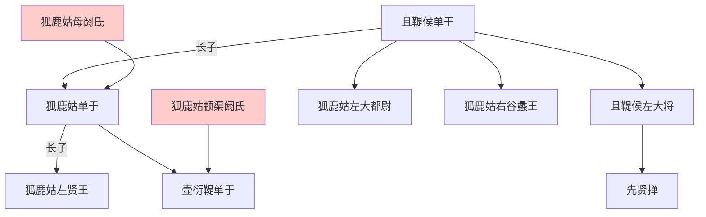

---
export_on_save:
    html: true
---

# 五單于爭立
- 另見：[匈奴世系圖](2_世系圖表/2.2_并立政權/漢/匈奴世系圖.html)

## 五單于爭立關係圖
- 匈奴五單于爭立背景，综合31401和31502

## 五單于爭立表

單于|佣立者|備註
--|--|--
呼韓邪單于|姑夕王、烏禪幕、左地貴人|敗握衍朐鞮單于。居東。敗屠耆單于，降車犂單于，复敗烏藉單于。被郅支單于擊敗後降漢。
屠耆單于|都隆奇、右賢王|居西。敗車犂單于、烏藉單于、呼揭單于。被呼韓邪單于敗後自殺。
呼揭單于|自立|讒右賢王被追殺後自立，居西北。車犂單于兵敗投靠，呼揭單于去號臣服。
車犂單于|自立|屠耆單于屬下，原右奧鞬王。被屠耆單于繫至呼揭單于處取而代之。再次被擊敗西北逃。最終降呼韓邪單于。
烏藉單于|自立、李陵子|屠耆單于屬下，原烏藉都尉。被都隆奇擊敗投靠呼揭單于。呼韓邪滅屠耆單于後-56年再次被李陵子擁立，被呼韓邪殺。
閏振單于|自立|屠耆單于從弟，五單于統一後自立居西。攻郅支單于被反殺。
郅支單于|自立|呼韓邪兄呼屠吾斯，左賢王，五單于統一後自立居東。殺閏振單于，擊敗呼韓邪單于。避漢向西方擴張。
伊利目單于|自立|屠耆單于小弟，收屠耆、閏振餘兵自立，被郅支殺。