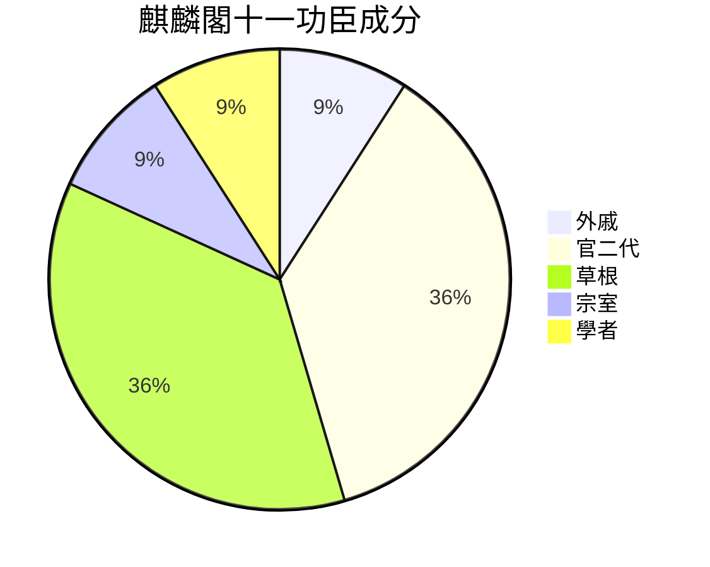

---
export_on_save:
    html: true
---

# 麒麟閣十一功臣

## 麒麟閣十一功臣成分
- 外戚：霍光
- 官二代：張安世、韓增、杜延年、蘇武
- 草根：趙充國、魏相、丙吉、蕭望之
- 宗室：劉德
- 學者：梁丘賀

```mermaid
pie
  title 麒麟閣十一功臣成分
  "外戚" : 1
  "官二代" : 4
  "草根" : 4
  "宗室" : 1
  "學者" : 1
```