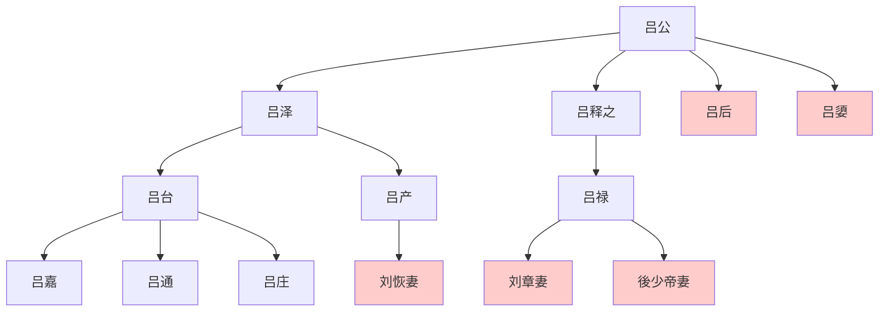

> 2021/2/2->2021/2/11

# 305 卷十三 汉纪五

> -187->-178

## 30501 立诸吕
> 冬，太后议欲立诸吕为王->太后封女弟嬃为临光侯
- 白马王子可以屠杀白马作盟誓，故能赢得公主芳心
- 諸呂世系圖

- 漢惠帝掛名子嗣表

姓名|别名|卒年|封号|谥号|备注
--|--|--|--|--|--|--
刘？||-184|前少帝||傀儡一号，一说名刘恭
刘强|刘彊|-183|淮阳王|怀|
刘不疑||-186|恒山王|哀|
刘弘|刘山、刘义|-180|恒山王、後少帝||傀儡二号
刘朝||-180|轵侯、恒山王||
刘武||-180|壶关侯、淮阳王||
刘太||-180|昌平侯、吕王、济川王、梁王||最幼子

## 30502 立後少帝
> 少帝浸长->略二千馀人

- 半两钱从战国秦一直用至武帝。秦始皇时期严格按半两铸造；刘邦时开始私铸缩水，出现荚钱（不足份量）；吕后时铸八铢钱、五分钱；文帝铸四铢；武帝先行三铢，半两钱停用，後定五铢形成标准，私铸停止，一直延续下来；期间王莽时突发奇想，钱币品种繁多制作精美使用混乱，出现金错刀；另董卓用始皇金人铸小钱，又一轮混乱；东晋以后五铢钱渐混乱，至唐开启年号通宝钱。

## 30503 诸吕为王后
> 春，正月，太后召赵幽王友->废其嗣

## 30504 朱虚立威及平勃调和
> 是时，诸吕擅权用事->钱五百万遗陆生为饮食费
- 以陈平之智需要陆贾来调解周勃，可见实际关系很差

## 30505 吕后崩
> 太后使使告代王->以左丞相审食其为帝太傅

## 30506 平定诸吕
> 诸吕欲为乱->谊存君亲可也
- 诛吕安刘疑点：为什么要把惠帝后裔杀光？吕禄吕产受吕后遗命，为何一骗一准？为什么迎立汉文帝时周勃要请间说话？
- 郦寄苦命，老父被绑架不得已卖友，想娶的女人是皇帝的丈母娘

## 30507 迎立文帝
> 诸大臣相与阴谋曰->下诏书赦天下
- 不知驷钧是否虎而冠，但知刘襄骗走了刘泽的兵权
- 天子卤簿有大驾、法驾、小驾
- 周勃文帝斗法
  - 周勃想私下传帝位，宋昌要求公开
  - 除宫後未央宫还有守卫持戟，周勃协助开道
  - 文帝进宫后直接让宋昌管南北军，夺周勃兵权

## 30508 文帝初治国
> 冬，十月，庚戌，徙琅邪王泽为燕王->左丞相平专为丞相
- 刘泽骗来琅邪王，又被刘襄骗走。骗刘襄脱身後疯狂报复，最终骗得燕王，刘襄无增益。
- 各种表现证明周勃属于无脑匹夫，所以韩信看不起，辞官时文帝都不象征性挽留。平勃之事谋略必出陈平，陈平与周勃交好也必然就是找一个顶锅的

## 30509 南越复称臣
> 初，隆虑侯灶击南越->不敢为帝矣

## 30510 举贾谊及贾山进言
> 齐哀王襄薨->上嘉纳其言

## 30511 袁盎贾谊进言
> 上每朝->窃为陛下惜之

## 30512 至文帝前元二年
> 上感谊言->燕敬王泽薨

- 诽谤之木衍生为华表，留言板连写字的地方都没了，在它面前的所有腹诽和面谤重新成为了妖言之罪
