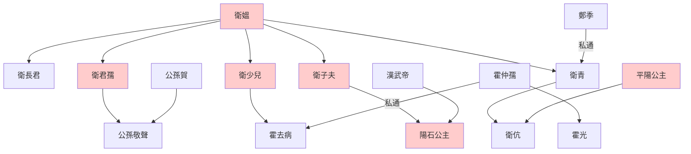

> 2021/3/10->2021/3/16

# 309 卷十七 汉纪九

> -140->-134

## 30901 董仲舒罢黜百家
> 冬，十月，诏举贤良方正直言极谏之士->民知所从矣
- 各級教育機構：家有塾，黨有庠，遂有序，國有學
- 牢獄別稱

時代|名稱
--|--
夏朝|均臺
商朝|羑里
周朝|圜土
秦朝|囹圄
漢朝|若盧
曹魏|司空

- 尊其所闻，则高明矣；行其所知，则光大矣。高明光大，不在于他，在乎加之意而已。曾子的洗腦，只要按我說的做就高明光大了。
- 天人三問：夫乐而不乱，复而不厌者，谓之道。董仲舒的道，带来快乐而不迷乱心神，反复进行而不厌恶，的确是有道之事。

## 30902 黄老儒术之争
> 天子善其对->申公亦以疾免归

## 30903 万石君及窦田易勢
> 初，景帝以太子太傅石奋及四子皆二千石->以太常柏至侯许昌为丞相

## 30904 卫子夫卫青得宠
> 初，堂邑侯陈午尚帝姑馆陶公主嫖->青为太中大夫
- 衛霍裙帶世系

  - 另：曹時與平陽公主子曹襄，尚漢武帝與衛子夫女衛長公主

## 30905 閩越繫東甌
> 夏，四月，有星如日，夜出->日有食之

## 30906 武帝微行及起上林苑
> 上自初即位->上善之
- 漢武帝早年和秦武王無異，好驰骋畋猎打野獸，還微服私訪搞得百姓怨聲載道

## 30907 田蚡囂張及劉安論百越
> 夏，有风赤如血->臣安窃恐将吏之以十万之师为一使之任也

## 30908 閩越雙王
> 是时，汉兵遂出->韩安国为御史大夫

## 30909 汲黯
> 东海太守濮阳汲黯为主爵都尉->近之矣

## 30910 李廣程不識治軍簡繁論
> 匈奴来请和亲->日有食之
