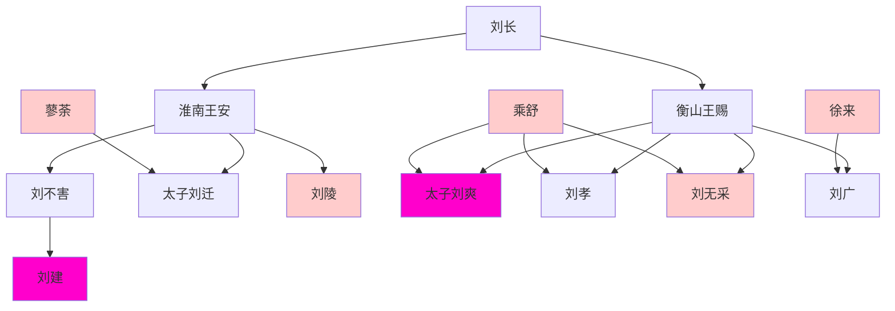
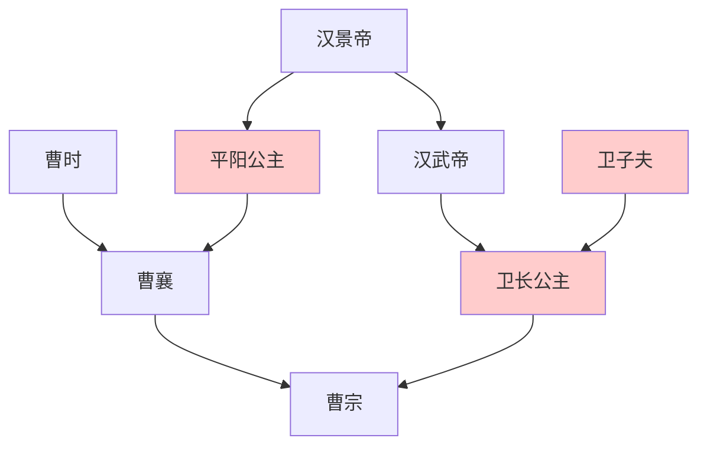

> 2021/3/24->2021/4/1

# 311 卷十九 汉纪十一

> -124->-119

## 31101 公孙弘报私仇
> 冬，十一月，乙丑，薛泽免->春，大旱
- 汉武帝时未行枪支管制，避免坏人管也管不住，好人又被剥夺了自卫的权力。

## 31102 漠南之战及敬汲黯
> 匈奴右贤王数侵扰朔方->其见敬礼如此
- 韩说内能当男宠，外能当将军，全才

## 31103 淮南衡山反谋
> 夏，六月，诏曰->上赐书不朝
- 淮南衡山謀反世系

- 衡山王家族事迹
  - 第一任王后乘舒死，徐来为王后，厥姬俱幸，向太子刘爽告发徐来蛊杀乘舒，太子刘爽与徐来结仇
  - 刘无采被休，与奴奸，与客奸，受太子刘爽教育，与之结仇
  - 徐来与刘孝刘无采结盟共抗太子刘爽，衡山王赐揍之，欲改立刘孝
  - 徐来想同时废刘孝，立自己儿子刘广。安排刘孝与衡山王赐侍者通奸
  - 太子刘爽想封徐来口避免诋毁自己，欲与之通奸未遂，被告发，抖出所有通奸事，出走，被抓回
  - 衡山王赐上书正式废立太子，太子刘爽告发刘孝造反及通奸。经核实，全家被杀

## 31104 霍去病出山及武功爵
> 春，二月，大将军青出定襄->官职耗废矣
- 武功爵表：霍去病刚出山，国库已耗尽，开始卖武功爵

级别|名称
--|--
1|造士
2|閑輿
3|良士
4|元戎士
5|官首
6|秉鐸
7|千夫
8|樂卿
9|執戎
10|政戾庶長
11|軍衛

## 31105 平淮南衡山王
> 冬，十月，上行幸雍，祠五畤，获兽->死者数万人
- 淮南王谋反，犹豫不决；太子刘迁坑爹，欲自杀未遂；伍被立劝不得成帮凶，反事不成自首终被斩…各种闹剧形成喜感

## 31106 张骞首次出使西域归国
> 夏，四月，赦天下->廷尉张汤为御史大夫
- 張騫兩次探索各國紀要

国名|现址|性质|备注
--|--|--|--
大宛|乌兹别克斯坦费尔干纳盆地|农耕|
乌孙|敦煌祁连间|游牧|
于窴|新疆和田|未知|
康居|新疆北部及中亚|游牧|
奄蔡|乌兹别克斯坦及哈萨克斯坦西南|游牧|位于中亚河中地区
大月氏|多次迁徙|游牧|被匈奴败分大小月氏，被乌孙败再次迁徙灭亡大夏，建贵霜帝国
大夏|阿富汗东北部|农耕|即巴克特里亚王国
身毒|印度|农耕|
安息|伊朗|农耕|
滇国|云南中部东部|农耕|
夜郎|贵州某处|农耕|

## 31107 河西之战
> 霍去病为票骑将军->杀略数百人
- 李广说：胡虏易与耳。要不是有大黄，和剧辛龙且一样。
- 赵破奴封从票侯，说白了就是跟班侯

## 31108 浑邪王降汉
> 江都王建与其父易王所幸淖姬等及女弟征臣奸->故赐日磾姓金氏
- 汉武帝的兄弟们，江都王建、中山王胜、胶西王端、赵王彭祖，基本都属人渣型，汉朝也算万幸

## 31109 神马汉乐府及盐铁官营
> 春，有星孛于东方->咸指怨汤
- 汉武帝作昆明池，乾隆作昆明湖
- 汉武帝能容忍汲黯有事没事不停哔哔，算有容人之量了
- 釱音弟，戴脚镣替代刖刑
- 张汤的算缗告缗政策：各家自己盘点财物上报，并按不同等阶缴税。不报和漏报，没收所有财物。告发他人不报漏报，获得没收财物的一半。
- 白鹿皮幣

币种|价值
--|--
白鹿皮币|四十万
龙文圜币|三千
马文方币|五百
龟文椭币|三百

## 31110 卜式捐款及漠北之战
> 初，河南人卜式->军吏卒皆无封侯者
- 李广全部战绩见下。祖上李信也是败军之将，全因人品好名垂千古。
  - 七国之乱：跟随周亚夫平乱有功，因私受梁王赏赐被撤职。後调任上谷太守防匈奴
  - 马邑之谋：参与
  - 龙城之战：被伊雉斜围歼，俘虏途中机智逃跑，得名飞将军
  - 河西之战：声称胡虏易与耳，被匈奴左贤王包围一天一夜，靠大黄撑场面，後张骞解围
  - 漠北之战：让卫青安排打前锋不允，路上迷路贻误战机自杀
- 死守外戚的平陽侯曹氏

## 31111 卫霍为人及酷吏横行
> 两军之出塞->于是诛文成将军而隐之
- 椎埋：盗墓
