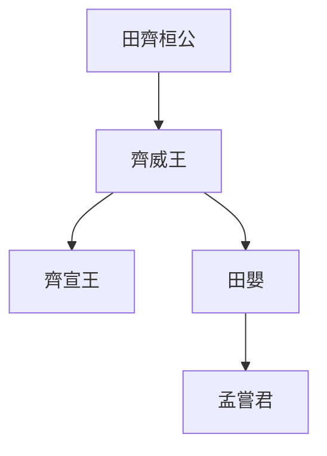

> 2020/7/30->2020/8/28

# 102 卷二 周纪二

> -368->-321

## 10201 至顯王七年
> 齐伐魏->子文公立

- 石門之戰，吳起已死，商鞅未來，秦斬首魏六萬人，秦軍國主義模式開啟，魏吃光最後的老本。

## 10202 秦孝公及商鞅变法
> 秦献公薨->赵、齐、宋会于平陆
- 商鞅变法，将国家打造为1984，恐惧高压只能营造表面的和谐。司马光所说的信，是法家的严酷和愚民的不知变通。
- 商鞅喷甘龙是革新派制胜守旧派的标杆。
- 韓懿侯与韓昭侯更迭时间不符，舍通鉴
- 商鞅二十等爵

等級|名稱|類別|備註
--|--|--|--
1|公士|士|步卒之有爵者
2|上造|士|步卒
3|簪褭|士|御駟馬者
4|不更|士|車右，不復與凡更卒同
5|大夫|大夫/軍吏|大夫在車左
6|官大夫|大夫/軍吏|
7|公大夫|大夫/軍吏|
8|公乘|大夫/軍吏|雖非臨戰，得公乘車。吏民爵不得過公乘。
9|五大夫|大夫/軍吏|
10|左庶長|九卿/軍將|左將軍
11|右庶長|九卿/軍將|右將軍
12|左更|九卿/軍將|
13|中更|九卿/軍將|
14|右更|九卿/軍將|
15|少上造|九卿/軍將|
16|大上造|九卿/軍將|
17|駟車庶長|九卿/軍將|
18|大庶長|九卿/軍將|大將軍
19|關內侯|諸侯|
20|徹侯|諸侯|

- 魯國論戰的曹劌之後屢戰屢敗，最後成為刺客曹沫，劫持齊桓公強搶土地。

## 10203 齊威魏惠論寶
> 齐威王、魏惠王会田于郊->楚王使景舍救赵

- 鲁共公与鲁康公司更迭时间不符，舍通鉴
- 楚国强族三闾：昭、屈、景

## 10204 桂陵之战
> 齐威王使田忌救赵->魏师大败

- 孙膑围魏最终并未救赵，主要是为了干死庞涓。
- 军师卧辎车渐成惯例，演化为诸葛亮的轮椅。

## 10205 至显王十八年
> 韩伐东周->与赵盟漳水上

## 10206 韓昭侯及申不害變法
> 韩昭侯以申不害为相->吾必待有功者

- 申不害变法以后给自己的亲戚走后门，韩昭侯拿自己的破裤头当宝贝。自古韩国多奇葩。

## 10207 至显王二十六年
> 秦商鞅筑冀阙宫庭于咸阳->秦孝公使公子少官帅师会诸侯于逢泽以朝王

- 鲁康公与鲁景公更迭时间不符，舍通鉴

## 10208 馬陵之戰
> 魏庞涓伐韩->出奔楚

- 齊威王時期諸田譜系

## 10209 魏獻河西及商鞅車裂
> 卫鞅言于秦孝公曰->宋太丘社亡

- 商鞅立威得罪太子，執法得罪國民，欺騙得罪敵國，出入全靠保鏢，還繼續貪圖賞賜，不聽人言而不自知，不死纔怪。

## 10210 孟子見梁惠王
> 邹人孟轲见魏惠王->所与言之人异故也

## 10211 至顯王三十六年
> 秦伐韩->子宣惠王立

- 死前珍惜一顰一笑破褲頭，死後開始腐敗造大門，如此的韓昭侯，是韓國最拿的出手的領導。

## 10212 蘇秦相六國
> 初，洛阳人苏秦说秦王以兼天下之术->车骑辎重拟于王者

- 雕阴之战

## 10213 至显王四十八年
> 齐威王薨->子哙立

- 河西之战
    - 第一次：魏文侯时期，魏国初兴，吴起夺秦河西
    - 第二次：魏武侯时期，阴晋之战，吴起守河西以少胜多
    - 第三次：秦献公时期，秦伐魏，石门之战斩首6万，少梁之战俘主将公叔痤
    - 第四次：秦孝公时期，商鞅变法，趁桂陵之战齐败魏之际偷袭，魏死而不僵，秦无功
    - 第五次：魏惠王称王，马陵之战齐败魏，魏死透，秦趁机攻夺河西。秦惠文王时期，雕阴之战全歼魏军，俘主将龙贾，收复全部河西

## 10214 孟嘗君
> 齐王封田婴于薛->君之国危矣

- 溫公說孟嘗君是挪用公款装大头蒜的富二代，找一批雞鳴狗盜之徒給自己撐排場，確實如此
